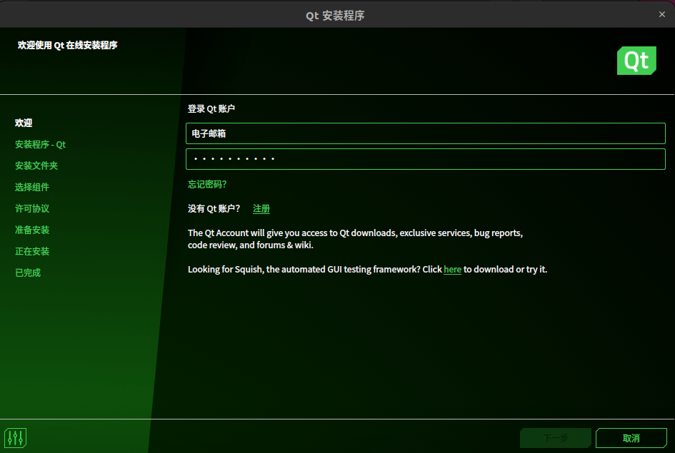
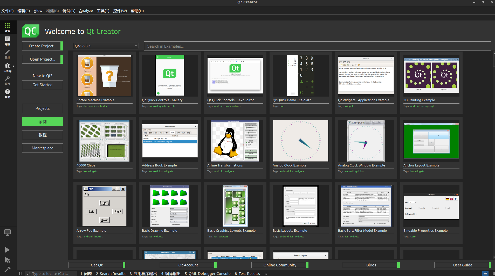
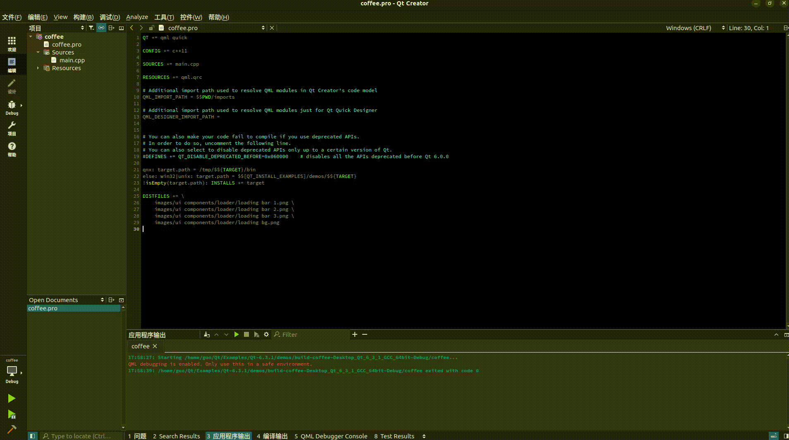

> Qt 是为嵌入式和桌面应用开发而生的跨平台软件开发平台

<!--more-->

#### 1、安装最基本要求

```shell
#Debian/Ubuntu （apt-get）
sudo apt-get install build-essential libgl1-mesa-dev


```

#### 2、下载Qt，并安装

```shell
//也可以直接去官网下载
wget https://d13lb3tujbc8s0.cloudfront.net/onlineinstallers/qt-unified-linux-x64-4.4.1-online.run
chmod +x qt-unified-linux-x64-4.4.1-online.run
./qt-unified-linux-x64-4.4.1-online.run
```



安装需要注册账号，同时里面的组建可根据需求进行安装。安装完成后显示



#### 3、选择一个代码实例进行测试，比如第一个



 
