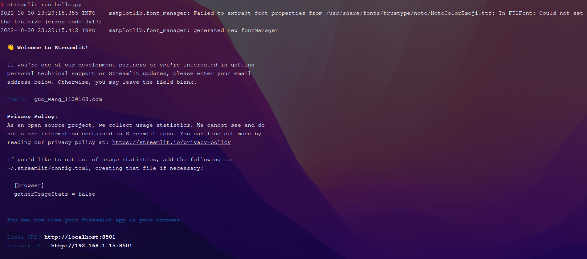
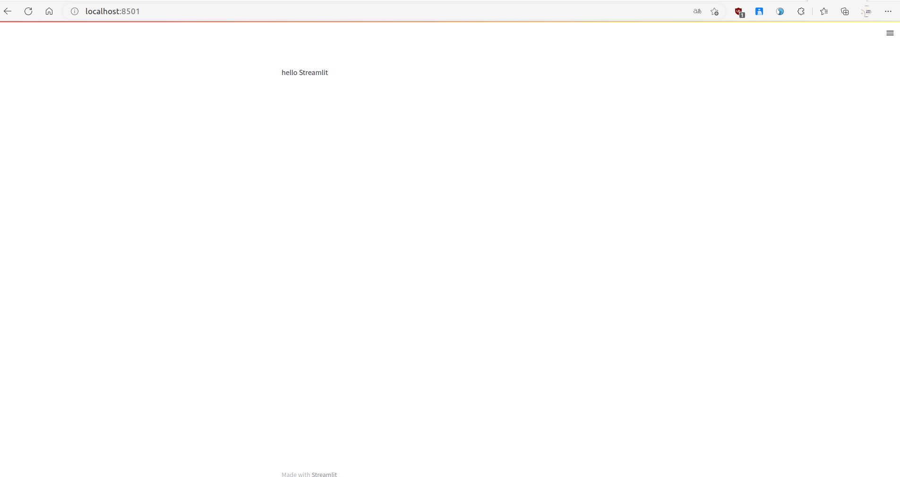

> 用写Python的代码完成一个Web App

<!--more-->

#### 1、Streamlit

项目地址：``` https://github.com/streamlit/streamlit ```


#### 2、安装与使用

- 安装

```shell
pip install streamlit 
```

- 构建可执行代码

在原有Python文件的基础上，import Streamlit，并设置数据显示模块即可。如有文件 hello.py ：

```python
import streamlit as st

st.write("hello streamlit")
```

- 执行命令``` streamlit run 文件.py ```。如：

```shell
streamlit run hello.py
```



执行命令后，点击跳转网页的链接，就可以看到效果。



#### 3、Streamlit官网

Streamlit可显示的数据也有很多，图表数据，视频等等都可以进行操作，同时也可以和其他Python模块结合使用。具体可参考[官网介绍](https://streamlit.io/)。