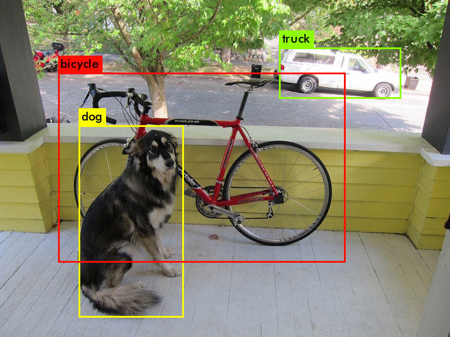

> YOLO: Real-Time Object Detection

<!--more-->

#### 1、下载yolo权重文件

```shell
mkdir model  #新建文件夹放权重文件
cd model
wget https://pjreddie.com/media/files/yolov3.weights
```

#### 2、测试图片

执行命令

```shell
./darknet detect cfg/yolov3.cfg model/yolov3.weights data/dog.jpg
```


结果显示

```shell
data/dog.jpg: Predicted in 0.048545 seconds.
dog: 100%
truck: 92%
bicycle: 99%
```



- 问题：

```shell
CUDA Error: out of memory
darknet: ./src/cuda.c:36: check_error: Assertion é0' failed.
```

修改``` yolov3.cfg```中的参数，注释掉training，启用testing参数。

```shell
# Testing
batch=1
subdivisions=1
# Training
# batch=32
# subdivisions=16
```

#### 3、利用摄像头进行目标检测

执行命令

```shell
./darknet detector demo cfg/coco.data cfg/yolov3.cfg model/yolov3.weights 
```


- 视频流检测的前提是正确安装opencv

```
wget https://codeload.github.com/opencv/opencv/zip/refs/tags/4.6.0
unzip 4.6.0
mv opencv-4.6.0 opencv
cd opencv
mkdir build
cd build
cmake -D CMAKE_BUILD_TYPE=Release -D OPENCV_GENERATE_PKGCONFIG=YES -D CMAKE_INSTALL_PREFIX=/usr/local/opencv4 WITH_GTK=ON ..
sudo make install
```

编译成功后，开始配置opencv。```sudo find / -iname opencv4.pc```查找opencv4.pc的路径，并添加到```sudo vim /etc/profile.d/pkgconfig.sh ```中：

```shell
[sudo] guo 的密码： 
find: ‘/run/user/1000/doc’: 权限不够
find: ‘/run/user/1000/gvfs’: 权限不够
/home/guo/opencv/build/unix-install/opencv4.pc
/usr/local/opencv4/lib/pkgconfig/opencv4.pc
```

```source /etc/profile```之后验证一下``` pkg-config --libs opencv4```

```shell
-L/usr/local/opencv4/lib -lopencv_gapi -lopencv_highgui -lopencv_ml -lopencv_objdetect -lopencv_photo -lopencv_stitching -lopencv_video -lopencv_calib3d -lopencv_features2d -lopencv_dnn -lopencv_flann -lopencv_videoio -lopencv_imgcodecs -lopencv_imgproc -lopencv_core
```

- 编译出现的问题1
  记得修改```makefile```中48/49行，opencv改成opencv4

```shell
LDFLAGS+= `pkg-config --libs opencv4` -lstdc++
COMMON+= `pkg-config --cflags opencv4` 
```


- 编译出现的问题2

```shell
./src/image_opencv.cpp:12:1: error: ‘IplImage’ 报错
```

这个是由于opencv版本问题导致，修改```src/image_opencv.cpp```文件，用下面的内容替换：

````shell
---
title: darknet测试yolo
top_img: 'https://pjreddie.com/media/image/yologo_2.png'
cover: 'https://pjreddie.com/media/image/yologo_2.png'
categories: AI
tags:
  - darknet
  - yolo
abbrlink: 38432
date: 2022-12-10 00:16:53

---

> YOLO: Real-Time Object Detection

<!--more-->

#### 1、下载yolo权重文件

```shell
mkdir model  #新建文件夹放权重文件
cd model
wget https://pjreddie.com/media/files/yolov3.weights
```

#### 2、测试图片

执行命令

```shell
./darknet detect cfg/yolov3.cfg model/yolov3.weights data/dog.jpg
```


结果显示

```shell
data/dog.jpg: Predicted in 0.048545 seconds.
dog: 100%
truck: 92%
bicycle: 99%
```


- 问题：

```shell
CUDA Error: out of memory
darknet: ./src/cuda.c:36: check_error: Assertion é0' failed.
```

修改``` yolov3.cfg```中的参数，注释掉training，启用testing参数。

```shell
# Testing
batch=1
subdivisions=1
# Training
# batch=32
# subdivisions=16
```

#### 3、利用摄像头进行目标检测

执行命令

```shell
./darknet detector demo cfg/coco.data cfg/yolov3.cfg model/yolov3.weights 
```


- 视频流检测的前提是正确安装opencv

```
wget https://codeload.github.com/opencv/opencv/zip/refs/tags/4.6.0
unzip 4.6.0
mv opencv-4.6.0 opencv
cd opencv
mkdir build
cd build
cmake -D CMAKE_BUILD_TYPE=Release -D OPENCV_GENERATE_PKGCONFIG=YES -D CMAKE_INSTALL_PREFIX=/usr/local/opencv4 WITH_GTK=ON ..
sudo make install
```

编译成功后，开始配置opencv。```sudo find / -iname opencv4.pc```查找opencv4.pc的路径，并添加到```sudo vim /etc/profile.d/pkgconfig.sh ```中：

```shell
[sudo] guo 的密码： 
find: ‘/run/user/1000/doc’: 权限不够
find: ‘/run/user/1000/gvfs’: 权限不够
/home/guo/opencv/build/unix-install/opencv4.pc
/usr/local/opencv4/lib/pkgconfig/opencv4.pc
```

```source /etc/profile```之后验证一下``` pkg-config --libs opencv4```

```shell
-L/usr/local/opencv4/lib -lopencv_gapi -lopencv_highgui -lopencv_ml -lopencv_objdetect -lopencv_photo -lopencv_stitching -lopencv_video -lopencv_calib3d -lopencv_features2d -lopencv_dnn -lopencv_flann -lopencv_videoio -lopencv_imgcodecs -lopencv_imgproc -lopencv_core
```

- 编译出现的问题1
  记得修改```makefile```中48/49行，opencv改成opencv4

```shell
LDFLAGS+= `pkg-config --libs opencv4` -lstdc++
COMMON+= `pkg-config --cflags opencv4` 
```


- 编译出现的问题2

```shell
./src/image_opencv.cpp:12:1: error: ‘IplImage’ 报错
```

这个是由于opencv版本问题导致，修改```src/image_opencv.cpp```文件，用下面的内容替换：

```shell
#ifdef OPENCV

#include "stdio.h"
#include "stdlib.h"
#include "opencv2/opencv.hpp"
#include "image.h"

using namespace cv;

extern "C" {

Mat image_to_mat(image im)
{
    image copy = copy_image(im);
    constrain_image(copy);
    if(im.c == 3) rgbgr_image(copy);

    Mat m(cv::Size(im.w,im.h), CV_8UC(im.c));
    int x,y,c;

    int step = m.step;
    for(y = 0; y < im.h; ++y){
        for(x = 0; x < im.w; ++x){
            for(c= 0; c < im.c; ++c){
                float val = im.data[c*im.h*im.w + y*im.w + x];
                m.data[y*step + x*im.c + c] = (unsigned char)(val*255);
            }
        }
    }

    free_image(copy);
    return m;
}

image mat_to_image(Mat m)
{
    int h = m.rows;
    int w = m.cols;
    int c = m.channels();
    image im = make_image(w, h, c);
    unsigned char *data = (unsigned char *)m.data;
    int step = m.step;
    int i, j, k;

    for(i = 0; i < h; ++i){
        for(k= 0; k < c; ++k){
            for(j = 0; j < w; ++j){
                im.data[k*w*h + i*w + j] = data[i*step + j*c + k]/255.;
            }
        }
    }
    rgbgr_image(im);
    return im;
}

void *open_video_stream(const char *f, int c, int w, int h, int fps)
{
    VideoCapture *cap;
    if(f) cap = new VideoCapture(f);
    else cap = new VideoCapture(c);
    if(!cap->isOpened()) return 0;
    if(w) cap->set(CAP_PROP_FRAME_WIDTH, w);
    if(h) cap->set(CAP_PROP_FRAME_HEIGHT, w);
    if(fps) cap->set(CAP_PROP_FPS, w);
    return (void *) cap;
}

image get_image_from_stream(void *p)
{
    VideoCapture *cap = (VideoCapture *)p;
    Mat m;
    *cap >> m;
    if(m.empty()) return make_empty_image(0,0,0);
    return mat_to_image(m);
}

image load_image_cv(char *filename, int channels)
{
    int flag = -1;
    if (channels == 0) flag = -1;
    else if (channels == 1) flag = 0;
    else if (channels == 3) flag = 1;
    else {
        fprintf(stderr, "OpenCV can't force load with %d channels\n", channels);
    }
    Mat m;
    m = imread(filename, flag);
    if(!m.data){
        fprintf(stderr, "Cannot load image \"%s\"\n", filename);
        char buff[256];
        sprintf(buff, "echo %s >> bad.list", filename);
        system(buff);
        return make_image(10,10,3);
        //exit(0);
    }
    image im = mat_to_image(m);
    return im;
}

int show_image_cv(image im, const char* name, int ms)
{
    Mat m = image_to_mat(im);
    imshow(name, m);
    int c = waitKey(ms);
    if (c != -1) c = c%256;
    return c;
}

void make_window(char *name, int w, int h, int fullscreen)
{
    namedWindow(name, WINDOW_NORMAL); 
    if (fullscreen) {
        setWindowProperty(name, WND_PROP_FULLSCREEN, WINDOW_FULLSCREEN);
    } else {
        resizeWindow(name, w, h);
        if(strcmp(name, "Demo") == 0) moveWindow(name, 0, 0);
    }
}

}

#endif
```
````