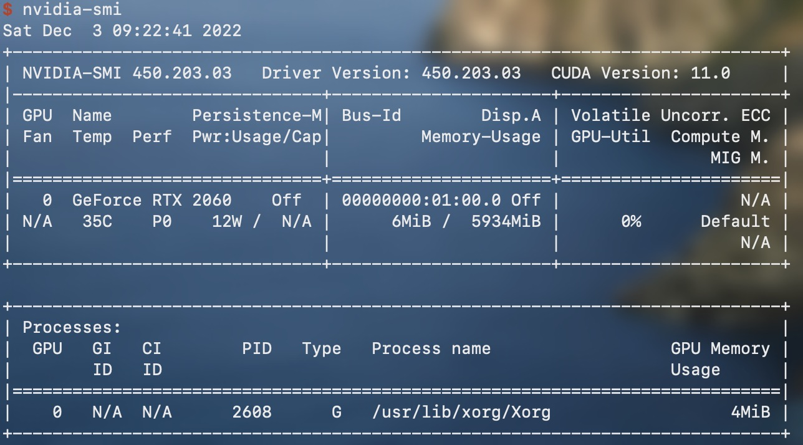
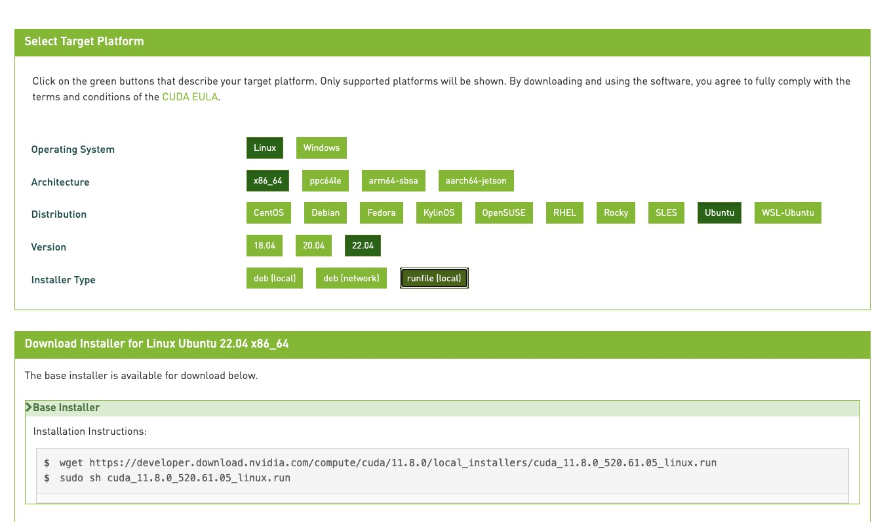

> Darknet: Open Source Neural Networks in C

<!--more-->

#### 1、darknet下载

```shell
git clone https://github.com/pjreddie/darknet.git
cd darknet
```
设置``` makefile ```

```shell
gpu=1 
cudnn=1 
opencv=1
```

【1】GPU=1;需要设置显卡驱动、cuda

- 使用``` nvidia-smi ```查看显卡型号和支持的cuda版本号



- [nvidia官网](https://developer.nvidia.com/cuda-downloads?target_os=Linux&target_arch=x86_64&Distribution=Ubuntu&target_version=22.04&target_type=runfile_local)下载cuda,以及cudnn



安装cuda若提示
```shell
Existing package manager installation of the driver found. It is strongly recommended that you remove this before continuing

```
原因是驱动重复安装，卸载掉其他驱动
```shell
dpkg -l | grep Nvidia //查看驱动
sudo apt-get purge "nvidia*"  //卸载旧版本驱动
```
然后再次安装就正常了。成功之后显示
```shell
===========
= Summary =
===========

Driver:   Not Selected
Toolkit:  Installed in /usr/local/cuda-11.6/

Please make sure that
 -   PATH includes /usr/local/cuda-11.6/bin
 -   LD_LIBRARY_PATH includes /usr/local/cuda-11.6/lib64, or, add /usr/local/cuda-11.6/lib64 to /etc/ld.so.conf and run ldconfig as root

To uninstall the CUDA Toolkit, run cuda-uninstaller in /usr/local/cuda-11.6/bin
***WARNING: Incomplete installation! This installation did not install the CUDA Driver. A driver of version at least 510.00 is required for CUDA 11.6 functionality to work.
To install the driver using this installer, run the following command, replacing <CudaInstaller> with the name of this run file:
    sudo <CudaInstaller>.run --silent --driver

Logfile is /var/log/cuda-installer.log
```

添加cuda到系统路径，``` vim ~/.zshrv ```
```shell
export PATH=/usr/local/cuda-11.6/bin${PATH:+:${PATH}}
export LD_LIBRARY_PATH=/usr/local/cuda-11.6/lib64${LD_LIBRARY_PATH:+:${LD_LIBRARY_PATH}}
```
运行``` source ~/.zshrc ```让路径生效，此时可以输入命令``` nvcc -V``` 验证一下cuda
```shell
nvcc: NVIDIA (R) Cuda compiler driver
Copyright (c) 2005-2022 NVIDIA Corporation
Built on Thu_Feb_10_18:23:41_PST_2022
Cuda compilation tools, release 11.6, V11.6.112
Build cuda_11.6.r11.6/compiler.30978841_0
```

【2】cudnn=1
- [nvidia官网](https://developer.nvidia.com/rdp/cudnn-download)选择相应版本的cudnn,进行下载（建议下载可解压版本的，方便自己操作）

将解压出来的cudnn文件copy到cuda路径中(```usl/local```中会有两个cuda路径，一个带版本号，一个不带，记得是copy到不带版本号的cuda路径中)
```shell
sudo cp include/cudnn*.h /usr/local/cuda/include
sudo cp lib/libcudnn* /usr/local/cuda/lib64
sudo chmod a+r /usr/local/cuda/include/cudnn*.h /usr/local/cuda/lib64/libcudnn*
``` 
copy完成之后用```cat /usr/local/cuda/include/cudnn_version.h | grep CUDNN_MAJOR -A 2 ```验证一下
```shell
#define CUDNN_MAJOR 8
#define CUDNN_MINOR 7
#define CUDNN_PATCHLEVEL 0
--
#define CUDNN_VERSION (CUDNN_MAJOR * 1000 + CUDNN_MINOR * 100 + CUDNN_PATCHLEVEL)
```
【3】opencv=1

#### 2、darknet编译
由于版本问题，需要先修改几个文件

- 用```https://github.com/arnoldfychen/darknet/blob/master/src/convolutional_layer.c ```直接替换```darknet/src/convolutional_laye.c```文件，老版本不支持cudnn8以上的
  
```c
#include "convolutional_layer.h"
#include "utils.h"
#include "batchnorm_layer.h"
#include "im2col.h"
#include "col2im.h"
#include "blas.h"
#include "gemm.h"
#include <stdio.h>
#include <time.h>

#define PRINT_CUDNN_ALGO 0
#define MEMORY_LIMIT 2000000000

#ifdef AI2
#include "xnor_layer.h"
#endif

void swap_binary(convolutional_layer *l)
{
    float *swap = l->weights;
    l->weights = l->binary_weights;
    l->binary_weights = swap;

#ifdef GPU
    swap = l->weights_gpu;
    l->weights_gpu = l->binary_weights_gpu;
    l->binary_weights_gpu = swap;
#endif
}

void binarize_weights(float *weights, int n, int size, float *binary)
{
    int i, f;
    for(f = 0; f < n; ++f){
        float mean = 0;
        for(i = 0; i < size; ++i){
            mean += fabs(weights[f*size + i]);
        }
        mean = mean / size;
        for(i = 0; i < size; ++i){
            binary[f*size + i] = (weights[f*size + i] > 0) ? mean : -mean;
        }
    }
}

void binarize_cpu(float *input, int n, float *binary)
{
    int i;
    for(i = 0; i < n; ++i){
        binary[i] = (input[i] > 0) ? 1 : -1;
    }
}

void binarize_input(float *input, int n, int size, float *binary)
{
    int i, s;
    for(s = 0; s < size; ++s){
        float mean = 0;
        for(i = 0; i < n; ++i){
            mean += fabs(input[i*size + s]);
        }
        mean = mean / n;
        for(i = 0; i < n; ++i){
            binary[i*size + s] = (input[i*size + s] > 0) ? mean : -mean;
        }
    }
}

int convolutional_out_height(convolutional_layer l)
{
    return (l.h + 2*l.pad - l.size) / l.stride + 1;
}

int convolutional_out_width(convolutional_layer l)
{
    return (l.w + 2*l.pad - l.size) / l.stride + 1;
}

image get_convolutional_image(convolutional_layer l)
{
    return float_to_image(l.out_w,l.out_h,l.out_c,l.output);
}

image get_convolutional_delta(convolutional_layer l)
{
    return float_to_image(l.out_w,l.out_h,l.out_c,l.delta);
}

static size_t get_workspace_size(layer l){
#ifdef CUDNN
    if(gpu_index >= 0){
        size_t most = 0;
        size_t s = 0;
        cudnnGetConvolutionForwardWorkspaceSize(cudnn_handle(),
                l.srcTensorDesc,
                l.weightDesc,
                l.convDesc,
                l.dstTensorDesc,
                l.fw_algo,
                &s);
        if (s > most) most = s;
        cudnnGetConvolutionBackwardFilterWorkspaceSize(cudnn_handle(),
                l.srcTensorDesc,
                l.ddstTensorDesc,
                l.convDesc,
                l.dweightDesc,
                l.bf_algo,
                &s);
        if (s > most) most = s;
        cudnnGetConvolutionBackwardDataWorkspaceSize(cudnn_handle(),
                l.weightDesc,
                l.ddstTensorDesc,
                l.convDesc,
                l.dsrcTensorDesc,
                l.bd_algo,
                &s);
        if (s > most) most = s;
        return most;
    }
#endif
    return (size_t)l.out_h*l.out_w*l.size*l.size*l.c/l.groups*sizeof(float);
}

#ifdef GPU
#ifdef CUDNN
void cudnn_convolutional_setup(layer *l)
{
    cudnnSetTensor4dDescriptor(l->dsrcTensorDesc, CUDNN_TENSOR_NCHW, CUDNN_DATA_FLOAT, l->batch, l->c, l->h, l->w); 
    cudnnSetTensor4dDescriptor(l->ddstTensorDesc, CUDNN_TENSOR_NCHW, CUDNN_DATA_FLOAT, l->batch, l->out_c, l->out_h, l->out_w); 

    cudnnSetTensor4dDescriptor(l->srcTensorDesc, CUDNN_TENSOR_NCHW, CUDNN_DATA_FLOAT, l->batch, l->c, l->h, l->w); 
    cudnnSetTensor4dDescriptor(l->dstTensorDesc, CUDNN_TENSOR_NCHW, CUDNN_DATA_FLOAT, l->batch, l->out_c, l->out_h, l->out_w); 
    cudnnSetTensor4dDescriptor(l->normTensorDesc, CUDNN_TENSOR_NCHW, CUDNN_DATA_FLOAT, 1, l->out_c, 1, 1); 

    cudnnSetFilter4dDescriptor(l->dweightDesc, CUDNN_DATA_FLOAT, CUDNN_TENSOR_NCHW, l->n, l->c/l->groups, l->size, l->size); 
    cudnnSetFilter4dDescriptor(l->weightDesc, CUDNN_DATA_FLOAT, CUDNN_TENSOR_NCHW, l->n, l->c/l->groups, l->size, l->size); 
    #if CUDNN_MAJOR >= 6
    cudnnSetConvolution2dDescriptor(l->convDesc, l->pad, l->pad, l->stride, l->stride, 1, 1, CUDNN_CROSS_CORRELATION, CUDNN_DATA_FLOAT);
    #else
    cudnnSetConvolution2dDescriptor(l->convDesc, l->pad, l->pad, l->stride, l->stride, 1, 1, CUDNN_CROSS_CORRELATION);
    #endif

    #if CUDNN_MAJOR >= 7
    cudnnSetConvolutionGroupCount(l->convDesc, l->groups);
    #else
    if(l->groups > 1){
        error("CUDNN < 7 doesn't support groups, please upgrade!");
    }
    #endif
    #if CUDNN_MAJOR >= 8
    int returnedAlgoCount;
    cudnnConvolutionFwdAlgoPerf_t       fw_results[2 * CUDNN_CONVOLUTION_FWD_ALGO_COUNT];
    cudnnConvolutionBwdDataAlgoPerf_t   bd_results[2 * CUDNN_CONVOLUTION_BWD_DATA_ALGO_COUNT];
    cudnnConvolutionBwdFilterAlgoPerf_t bf_results[2 * CUDNN_CONVOLUTION_BWD_FILTER_ALGO_COUNT];

    cudnnFindConvolutionForwardAlgorithm(cudnn_handle(),
            l->srcTensorDesc,
            l->weightDesc,
            l->convDesc,
            l->dstTensorDesc,
            CUDNN_CONVOLUTION_FWD_ALGO_COUNT,
            &returnedAlgoCount,
	    fw_results);
    for(int algoIndex = 0; algoIndex < returnedAlgoCount; ++algoIndex){
        #if PRINT_CUDNN_ALGO > 0
        printf("^^^^ %s for Algo %d: %f time requiring %llu memory\n",
               cudnnGetErrorString(fw_results[algoIndex].status),
               fw_results[algoIndex].algo, fw_results[algoIndex].time,
               (unsigned long long)fw_results[algoIndex].memory);
        #endif
        if( fw_results[algoIndex].memory < MEMORY_LIMIT ){
            l->fw_algo = fw_results[algoIndex].algo;
            break;
	}
    }

    cudnnFindConvolutionBackwardDataAlgorithm(cudnn_handle(),
            l->weightDesc,
            l->ddstTensorDesc,
            l->convDesc,
            l->dsrcTensorDesc,
            CUDNN_CONVOLUTION_BWD_DATA_ALGO_COUNT,
            &returnedAlgoCount,
            bd_results);
    for(int algoIndex = 0; algoIndex < returnedAlgoCount; ++algoIndex){
        #if PRINT_CUDNN_ALGO > 0
        printf("^^^^ %s for Algo %d: %f time requiring %llu memory\n",
               cudnnGetErrorString(bd_results[algoIndex].status),
               bd_results[algoIndex].algo, bd_results[algoIndex].time,
               (unsigned long long)bd_results[algoIndex].memory);
        #endif
        if( bd_results[algoIndex].memory < MEMORY_LIMIT ){
            l->bd_algo = bd_results[algoIndex].algo;
            break;
        }
    }

    cudnnFindConvolutionBackwardFilterAlgorithm(cudnn_handle(),
            l->srcTensorDesc,
            l->ddstTensorDesc,
            l->convDesc,
            l->dweightDesc,
            CUDNN_CONVOLUTION_BWD_FILTER_ALGO_COUNT,
            &returnedAlgoCount,
            bf_results);
    for(int algoIndex = 0; algoIndex < returnedAlgoCount; ++algoIndex){
        #if PRINT_CUDNN_ALGO > 0
        printf("^^^^ %s for Algo %d: %f time requiring %llu memory\n",
               cudnnGetErrorString(bf_results[algoIndex].status),
               bf_results[algoIndex].algo, bf_results[algoIndex].time,
               (unsigned long long)bf_results[algoIndex].memory);
        #endif
        if( bf_results[algoIndex].memory < MEMORY_LIMIT ){
            l->bf_algo = bf_results[algoIndex].algo;
            break;
        }
    }

    #else

    cudnnGetConvolutionForwardAlgorithm(cudnn_handle(),
            l->srcTensorDesc,
            l->weightDesc,
            l->convDesc,
            l->dstTensorDesc,
            CUDNN_CONVOLUTION_FWD_SPECIFY_WORKSPACE_LIMIT,
            2000000000,
            &l->fw_algo);
    cudnnGetConvolutionBackwardDataAlgorithm(cudnn_handle(),
            l->weightDesc,
            l->ddstTensorDesc,
            l->convDesc,
            l->dsrcTensorDesc,
            CUDNN_CONVOLUTION_BWD_DATA_SPECIFY_WORKSPACE_LIMIT,
            2000000000,
            &l->bd_algo);
    cudnnGetConvolutionBackwardFilterAlgorithm(cudnn_handle(),
            l->srcTensorDesc,
            l->ddstTensorDesc,
            l->convDesc,
            l->dweightDesc,
            CUDNN_CONVOLUTION_BWD_FILTER_SPECIFY_WORKSPACE_LIMIT,
            2000000000,
            &l->bf_algo);
    #endif
}
#endif
#endif

convolutional_layer make_convolutional_layer(int batch, int h, int w, int c, int n, int groups, int size, int stride, int padding, ACTIVATION activation, int batch_normalize, int binary, int xnor, int adam)
{
    int i;
    convolutional_layer l = {0};
    l.type = CONVOLUTIONAL;

    l.groups = groups;
    l.h = h;
    l.w = w;
    l.c = c;
    l.n = n;
    l.binary = binary;
    l.xnor = xnor;
    l.batch = batch;
    l.stride = stride;
    l.size = size;
    l.pad = padding;
    l.batch_normalize = batch_normalize;

    l.weights = calloc(c/groups*n*size*size, sizeof(float));
    l.weight_updates = calloc(c/groups*n*size*size, sizeof(float));

    l.biases = calloc(n, sizeof(float));
    l.bias_updates = calloc(n, sizeof(float));

    l.nweights = c/groups*n*size*size;
    l.nbiases = n;

    // float scale = 1./sqrt(size*size*c);
    float scale = sqrt(2./(size*size*c/l.groups));
    //printf("convscale %f\n", scale);
    //scale = .02;
    //for(i = 0; i < c*n*size*size; ++i) l.weights[i] = scale*rand_uniform(-1, 1);
    for(i = 0; i < l.nweights; ++i) l.weights[i] = scale*rand_normal();
    int out_w = convolutional_out_width(l);
    int out_h = convolutional_out_height(l);
    l.out_h = out_h;
    l.out_w = out_w;
    l.out_c = n;
    l.outputs = l.out_h * l.out_w * l.out_c;
    l.inputs = l.w * l.h * l.c;

    l.output = calloc(l.batch*l.outputs, sizeof(float));
    l.delta  = calloc(l.batch*l.outputs, sizeof(float));

    l.forward = forward_convolutional_layer;
    l.backward = backward_convolutional_layer;
    l.update = update_convolutional_layer;
    if(binary){
        l.binary_weights = calloc(l.nweights, sizeof(float));
        l.cweights = calloc(l.nweights, sizeof(char));
        l.scales = calloc(n, sizeof(float));
    }
    if(xnor){
        l.binary_weights = calloc(l.nweights, sizeof(float));
        l.binary_input = calloc(l.inputs*l.batch, sizeof(float));
    }

    if(batch_normalize){
        l.scales = calloc(n, sizeof(float));
        l.scale_updates = calloc(n, sizeof(float));
        for(i = 0; i < n; ++i){
            l.scales[i] = 1;
        }

        l.mean = calloc(n, sizeof(float));
        l.variance = calloc(n, sizeof(float));

        l.mean_delta = calloc(n, sizeof(float));
        l.variance_delta = calloc(n, sizeof(float));

        l.rolling_mean = calloc(n, sizeof(float));
        l.rolling_variance = calloc(n, sizeof(float));
        l.x = calloc(l.batch*l.outputs, sizeof(float));
        l.x_norm = calloc(l.batch*l.outputs, sizeof(float));
    }
    if(adam){
        l.m = calloc(l.nweights, sizeof(float));
        l.v = calloc(l.nweights, sizeof(float));
        l.bias_m = calloc(n, sizeof(float));
        l.scale_m = calloc(n, sizeof(float));
        l.bias_v = calloc(n, sizeof(float));
        l.scale_v = calloc(n, sizeof(float));
    }

#ifdef GPU
    l.forward_gpu = forward_convolutional_layer_gpu;
    l.backward_gpu = backward_convolutional_layer_gpu;
    l.update_gpu = update_convolutional_layer_gpu;

    if(gpu_index >= 0){
        if (adam) {
            l.m_gpu = cuda_make_array(l.m, l.nweights);
            l.v_gpu = cuda_make_array(l.v, l.nweights);
            l.bias_m_gpu = cuda_make_array(l.bias_m, n);
            l.bias_v_gpu = cuda_make_array(l.bias_v, n);
            l.scale_m_gpu = cuda_make_array(l.scale_m, n);
            l.scale_v_gpu = cuda_make_array(l.scale_v, n);
        }

        l.weights_gpu = cuda_make_array(l.weights, l.nweights);
        l.weight_updates_gpu = cuda_make_array(l.weight_updates, l.nweights);

        l.biases_gpu = cuda_make_array(l.biases, n);
        l.bias_updates_gpu = cuda_make_array(l.bias_updates, n);

        l.delta_gpu = cuda_make_array(l.delta, l.batch*out_h*out_w*n);
        l.output_gpu = cuda_make_array(l.output, l.batch*out_h*out_w*n);

        if(binary){
            l.binary_weights_gpu = cuda_make_array(l.weights, l.nweights);
        }
        if(xnor){
            l.binary_weights_gpu = cuda_make_array(l.weights, l.nweights);
            l.binary_input_gpu = cuda_make_array(0, l.inputs*l.batch);
        }

        if(batch_normalize){
            l.mean_gpu = cuda_make_array(l.mean, n);
            l.variance_gpu = cuda_make_array(l.variance, n);

            l.rolling_mean_gpu = cuda_make_array(l.mean, n);
            l.rolling_variance_gpu = cuda_make_array(l.variance, n);

            l.mean_delta_gpu = cuda_make_array(l.mean, n);
            l.variance_delta_gpu = cuda_make_array(l.variance, n);

            l.scales_gpu = cuda_make_array(l.scales, n);
            l.scale_updates_gpu = cuda_make_array(l.scale_updates, n);

            l.x_gpu = cuda_make_array(l.output, l.batch*out_h*out_w*n);
            l.x_norm_gpu = cuda_make_array(l.output, l.batch*out_h*out_w*n);
        }
#ifdef CUDNN
        cudnnCreateTensorDescriptor(&l.normTensorDesc);
        cudnnCreateTensorDescriptor(&l.srcTensorDesc);
        cudnnCreateTensorDescriptor(&l.dstTensorDesc);
        cudnnCreateFilterDescriptor(&l.weightDesc);
        cudnnCreateTensorDescriptor(&l.dsrcTensorDesc);
        cudnnCreateTensorDescriptor(&l.ddstTensorDesc);
        cudnnCreateFilterDescriptor(&l.dweightDesc);
        cudnnCreateConvolutionDescriptor(&l.convDesc);
        cudnn_convolutional_setup(&l);
#endif
    }
#endif
    l.workspace_size = get_workspace_size(l);
    l.activation = activation;

    fprintf(stderr, "conv  %5d %2d x%2d /%2d  %4d x%4d x%4d   ->  %4d x%4d x%4d  %5.3f BFLOPs\n", n, size, size, stride, w, h, c, l.out_w, l.out_h, l.out_c, (2.0 * l.n * l.size*l.size*l.c/l.groups * l.out_h*l.out_w)/1000000000.);

    return l;
}

void denormalize_convolutional_layer(convolutional_layer l)
{
    int i, j;
    for(i = 0; i < l.n; ++i){
        float scale = l.scales[i]/sqrt(l.rolling_variance[i] + .00001);
        for(j = 0; j < l.c/l.groups*l.size*l.size; ++j){
            l.weights[i*l.c/l.groups*l.size*l.size + j] *= scale;
        }
        l.biases[i] -= l.rolling_mean[i] * scale;
        l.scales[i] = 1;
        l.rolling_mean[i] = 0;
        l.rolling_variance[i] = 1;
    }
}

/*
void test_convolutional_layer()
{
    convolutional_layer l = make_convolutional_layer(1, 5, 5, 3, 2, 5, 2, 1, LEAKY, 1, 0, 0, 0);
    l.batch_normalize = 1;
    float data[] = {1,1,1,1,1,
        1,1,1,1,1,
        1,1,1,1,1,
        1,1,1,1,1,
        1,1,1,1,1,
        2,2,2,2,2,
        2,2,2,2,2,
        2,2,2,2,2,
        2,2,2,2,2,
        2,2,2,2,2,
        3,3,3,3,3,
        3,3,3,3,3,
        3,3,3,3,3,
        3,3,3,3,3,
        3,3,3,3,3};
    //net.input = data;
    //forward_convolutional_layer(l);
}
*/

void resize_convolutional_layer(convolutional_layer *l, int w, int h)
{
    l->w = w;
    l->h = h;
    int out_w = convolutional_out_width(*l);
    int out_h = convolutional_out_height(*l);

    l->out_w = out_w;
    l->out_h = out_h;

    l->outputs = l->out_h * l->out_w * l->out_c;
    l->inputs = l->w * l->h * l->c;

    l->output = realloc(l->output, l->batch*l->outputs*sizeof(float));
    l->delta  = realloc(l->delta,  l->batch*l->outputs*sizeof(float));
    if(l->batch_normalize){
        l->x = realloc(l->x, l->batch*l->outputs*sizeof(float));
        l->x_norm  = realloc(l->x_norm, l->batch*l->outputs*sizeof(float));
    }

#ifdef GPU
    cuda_free(l->delta_gpu);
    cuda_free(l->output_gpu);

    l->delta_gpu =  cuda_make_array(l->delta,  l->batch*l->outputs);
    l->output_gpu = cuda_make_array(l->output, l->batch*l->outputs);

    if(l->batch_normalize){
        cuda_free(l->x_gpu);
        cuda_free(l->x_norm_gpu);

        l->x_gpu = cuda_make_array(l->output, l->batch*l->outputs);
        l->x_norm_gpu = cuda_make_array(l->output, l->batch*l->outputs);
    }
#ifdef CUDNN
    cudnn_convolutional_setup(l);
#endif
#endif
    l->workspace_size = get_workspace_size(*l);
}

void add_bias(float *output, float *biases, int batch, int n, int size)
{
    int i,j,b;
    for(b = 0; b < batch; ++b){
        for(i = 0; i < n; ++i){
            for(j = 0; j < size; ++j){
                output[(b*n + i)*size + j] += biases[i];
            }
        }
    }
}

void scale_bias(float *output, float *scales, int batch, int n, int size)
{
    int i,j,b;
    for(b = 0; b < batch; ++b){
        for(i = 0; i < n; ++i){
            for(j = 0; j < size; ++j){
                output[(b*n + i)*size + j] *= scales[i];
            }
        }
    }
}

void backward_bias(float *bias_updates, float *delta, int batch, int n, int size)
{
    int i,b;
    for(b = 0; b < batch; ++b){
        for(i = 0; i < n; ++i){
            bias_updates[i] += sum_array(delta+size*(i+b*n), size);
        }
    }
}

void forward_convolutional_layer(convolutional_layer l, network net)
{
    int i, j;

    fill_cpu(l.outputs*l.batch, 0, l.output, 1);

    if(l.xnor){
        binarize_weights(l.weights, l.n, l.c/l.groups*l.size*l.size, l.binary_weights);
        swap_binary(&l);
        binarize_cpu(net.input, l.c*l.h*l.w*l.batch, l.binary_input);
        net.input = l.binary_input;
    }

    int m = l.n/l.groups;
    int k = l.size*l.size*l.c/l.groups;
    int n = l.out_w*l.out_h;
    for(i = 0; i < l.batch; ++i){
        for(j = 0; j < l.groups; ++j){
            float *a = l.weights + j*l.nweights/l.groups;
            float *b = net.workspace;
            float *c = l.output + (i*l.groups + j)*n*m;
            float *im =  net.input + (i*l.groups + j)*l.c/l.groups*l.h*l.w;

            if (l.size == 1) {
                b = im;
            } else {
                im2col_cpu(im, l.c/l.groups, l.h, l.w, l.size, l.stride, l.pad, b);
            }
            gemm(0,0,m,n,k,1,a,k,b,n,1,c,n);
        }
    }

    if(l.batch_normalize){
        forward_batchnorm_layer(l, net);
    } else {
        add_bias(l.output, l.biases, l.batch, l.n, l.out_h*l.out_w);
    }

    activate_array(l.output, l.outputs*l.batch, l.activation);
    if(l.binary || l.xnor) swap_binary(&l);
}

void backward_convolutional_layer(convolutional_layer l, network net)
{
    int i, j;
    int m = l.n/l.groups;
    int n = l.size*l.size*l.c/l.groups;
    int k = l.out_w*l.out_h;

    gradient_array(l.output, l.outputs*l.batch, l.activation, l.delta);

    if(l.batch_normalize){
        backward_batchnorm_layer(l, net);
    } else {
        backward_bias(l.bias_updates, l.delta, l.batch, l.n, k);
    }

    for(i = 0; i < l.batch; ++i){
        for(j = 0; j < l.groups; ++j){
            float *a = l.delta + (i*l.groups + j)*m*k;
            float *b = net.workspace;
            float *c = l.weight_updates + j*l.nweights/l.groups;

            float *im  = net.input + (i*l.groups + j)*l.c/l.groups*l.h*l.w;
            float *imd = net.delta + (i*l.groups + j)*l.c/l.groups*l.h*l.w;

            if(l.size == 1){
                b = im;
            } else {
                im2col_cpu(im, l.c/l.groups, l.h, l.w, 
                        l.size, l.stride, l.pad, b);
            }

            gemm(0,1,m,n,k,1,a,k,b,k,1,c,n);

            if (net.delta) {
                a = l.weights + j*l.nweights/l.groups;
                b = l.delta + (i*l.groups + j)*m*k;
                c = net.workspace;
                if (l.size == 1) {
                    c = imd;
                }

                gemm(1,0,n,k,m,1,a,n,b,k,0,c,k);

                if (l.size != 1) {
                    col2im_cpu(net.workspace, l.c/l.groups, l.h, l.w, l.size, l.stride, l.pad, imd);
                }
            }
        }
    }
}

void update_convolutional_layer(convolutional_layer l, update_args a)
{
    float learning_rate = a.learning_rate*l.learning_rate_scale;
    float momentum = a.momentum;
    float decay = a.decay;
    int batch = a.batch;

    axpy_cpu(l.n, learning_rate/batch, l.bias_updates, 1, l.biases, 1);
    scal_cpu(l.n, momentum, l.bias_updates, 1);

    if(l.scales){
        axpy_cpu(l.n, learning_rate/batch, l.scale_updates, 1, l.scales, 1);
        scal_cpu(l.n, momentum, l.scale_updates, 1);
    }

    axpy_cpu(l.nweights, -decay*batch, l.weights, 1, l.weight_updates, 1);
    axpy_cpu(l.nweights, learning_rate/batch, l.weight_updates, 1, l.weights, 1);
    scal_cpu(l.nweights, momentum, l.weight_updates, 1);
}


image get_convolutional_weight(convolutional_layer l, int i)
{
    int h = l.size;
    int w = l.size;
    int c = l.c/l.groups;
    return float_to_image(w,h,c,l.weights+i*h*w*c);
}

void rgbgr_weights(convolutional_layer l)
{
    int i;
    for(i = 0; i < l.n; ++i){
        image im = get_convolutional_weight(l, i);
        if (im.c == 3) {
            rgbgr_image(im);
        }
    }
}

void rescale_weights(convolutional_layer l, float scale, float trans)
{
    int i;
    for(i = 0; i < l.n; ++i){
        image im = get_convolutional_weight(l, i);
        if (im.c == 3) {
            scale_image(im, scale);
            float sum = sum_array(im.data, im.w*im.h*im.c);
            l.biases[i] += sum*trans;
        }
    }
}

image *get_weights(convolutional_layer l)
{
    image *weights = calloc(l.n, sizeof(image));
    int i;
    for(i = 0; i < l.n; ++i){
        weights[i] = copy_image(get_convolutional_weight(l, i));
        normalize_image(weights[i]);
        /*
           char buff[256];
           sprintf(buff, "filter%d", i);
           save_image(weights[i], buff);
         */
    }
    //error("hey");
    return weights;
}

image *visualize_convolutional_layer(convolutional_layer l, char *window, image *prev_weights)
{
    image *single_weights = get_weights(l);
    show_images(single_weights, l.n, window);

    image delta = get_convolutional_image(l);
    image dc = collapse_image_layers(delta, 1);
    char buff[256];
    sprintf(buff, "%s: Output", window);
    //show_image(dc, buff);
    //save_image(dc, buff);
    free_image(dc);
    return single_weights;
}

```

- 修改```/src/gemm.c```中的```cudaThreadSynchronize```为```cudaDeviceSynchronize```
- Makefile中添加,并删除掉低版本的信息
```shell
-gencode arch=compute_70,code=[sm_70,compute_70] \
-gencode arch=compute_75,code=[sm_75,compute_75] \
-gencode arch=compute_86,code=[sm_86,compute_86]
```

最后，用```make```命令编译

#### 3、编译出错
```/bin/sh: 1: nvcc: not found ```
sudo 

修改```Makefile```中``` nvcc ```的路径

```shell
NVCC=/usr/local/cuda/bin/nvcc
```