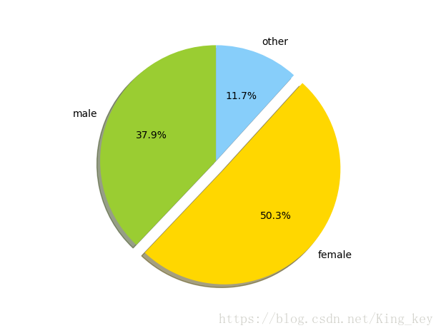

> 不是所有的微信账号都可以登陆网页版微信的哦

<!--more-->

#### 1、itchat

> itchat是微信的个人开放接口；本文利用Python+itchat实现简单的个人好友数量以及男女比例的统计

- 安装：` pip install itchat(需要权限的可以使用sudo)`

#### 2、代码

```
#coding=utf-8
import itchat,time
itchat.login()
#微信好友男女比例分析
friends=itchat.get_friends(update=True)[0:]

male=female=other=0
for i in friends[1:]:
    sex=i["Sex"]
    if sex==1:
        male+=1
    elif sex==2:
        female+=1
    else:other+=1

total=len(friends[1:])
print("男性好友: %.2f%%"%(float(male)/total*100)+"\n"
    + "女性好友: %.2f%%"%(float(female)/total*100)+"\n"
    + "性别不明:  %.2f%%"%(float(other)/total*100))

print "好友数量: ",male+female+other
print "男性好友: ",male
print "女性好友: ",female
print "性别不明: ",other


＃饼状图输出【这部分为后加，所以数据与前面不相符】

import matplotlib.pyplot as plt

labels="male","female","other"
sizes=[(float(male)/total*100),(float(female)/total*100),(float(other)/total*100)]
colors=['yellowgreen','gold','lightskyblue']
explode=(0,0.1,0)

plt.pie(sizes,explode=explode,labels=labels,colors=colors,autopct='%1.1f%%',shadow=True,startangle=90)
plt.axis('equal')
plt.show()

PYTHON
```

#### 3、结果截图



女性朋友稍多一点也就不说什么了，可是这性别不明是什么个意思？小编也是很无奈呀