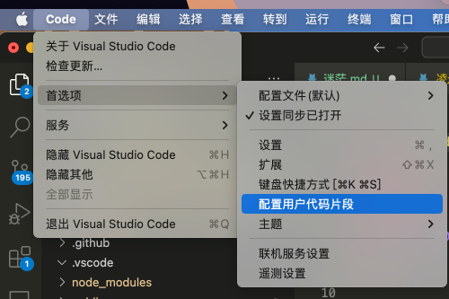
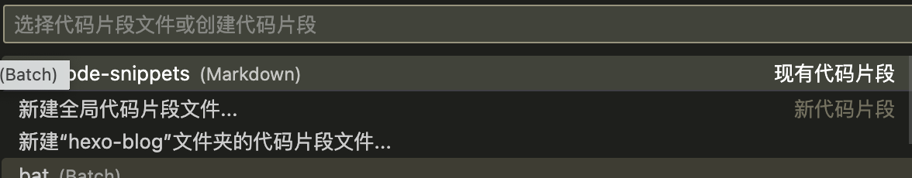

> 利用代码片段快速生成特定信息

#### 1、vscode中新建“用户代码片段”

- 打开“**code**“ - “**首选项**” - “**配置用户代码片段**”



- “**新建全局代码片段文件**”，文件名可随意




#### 2、创建自定义信息

- 文件默认信息是这样的

```shell
{
	// Place your 全局 snippets here. Each snippet is defined under a snippet name and has a scope, prefix, body and 
	// description. Add comma separated ids of the languages where the snippet is applicable in the scope field. If scope 
	// is left empty or omitted, the snippet gets applied to all languages. The prefix is what is 
	// used to trigger the snippet and the body will be expanded and inserted. Possible variables are: 
	// $1, $2 for tab stops, $0 for the final cursor position, and ${1:label}, ${2:another} for placeholders. 
	// Placeholders with the same ids are connected.
	// Example:
	// "Print to console": {
	// 	"scope": "javascript,typescript",
	// 	"prefix": "log",
	// 	"body": [
	// 		"console.log('$1');",
	// 		"$2"
	// 	],
	// 	"description": "Log output to console"
	// }
}
```

- 参数说明

```shell
scope: 文件类型
prefix: 表示触发条件
body: 表示显示的内容
description: 代码片段的描述
```

- 修改后的文件是这样的

```shell
{
	// Place your 全局 snippets here. Each snippet is defined under a snippet name and has a scope, prefix, body and 
	// description. Add comma separated ids of the languages where the snippet is applicable in the scope field. If scope 
	// is left empty or omitted, the snippet gets applied to all languages. The prefix is what is 
	// used to trigger the snippet and the body will be expanded and inserted. Possible variables are: 
	// $1, $2 for tab stops, $0 for the final cursor position, and ${1:label}, ${2:another} for placeholders. 
	// Placeholders with the same ids are connected.
	// Example:
	"Print to console": {
		"scope": "markdown",
		"prefix": "/date",
		"body": [
			"---",
			"title: ${TM_FILENAME_BASE}",
			"top_img: ",
			"cover: ",
			"categories: ${TM_DIRECTORY}",
			"abbrlink: ",
			"date: ${CURRENT_YEAR}-${CURRENT_MONTH}-${CURRENT_DATE}  ${CURRENT_HOUR}:${CURRENT_MINUTE}:${CURRENT_SECOND} ",
			"tags:",
			"---"
		],
		"description": "blog info"
	}
}
```

- 可以插入的**变量**

**使用规则：$name或${name:default}**

```TM_SELECTED_TEXT 当前选中的文本或空字符串
TM_CURRENT_LINE 当前行的内容
TM_CURRENT_WORD 光标下单词的内容或空字符串
TM_LINE_INDEX 基于零索引的行号
TM_LINE_NUMBER 基于一个索引的行号
TM_FILENAME 当前文档的文件名
TM_FILENAME_BASE 当前文档的文件名，不带扩展名
TM_DIRECTORY 当前文档的目录
TM_FILEPATH 当前文档的完整文件路径
RELATIVE_FILEPATH 当前文档的相对（相对于打开的工作区或文件夹）文件路径
CLIPBOARD 剪贴板的内容
WORKSPACE_NAME 打开的工作区或文件夹的名称
WORKSPACE_FOLDER 打开的工作区或文件夹的路径

插入当前日期和时间：

CURRENT_YEAR 本年度
CURRENT_YEAR_SHORT 当前年份的最后两位数字
CURRENT_MONTH 月份为两位数（例如“02”）
CURRENT_MONTH_NAME 月份的全名（例如“七月”）
CURRENT_MONTH_NAME_SHORT 月份的简称（例如“Jul”）
CURRENT_DATE 一个月中的哪一天
CURRENT_DAY_NAME 日期名称（例如“星期一”）
CURRENT_DAY_NAME_SHORT 一天的简称（例如“星期一”）
CURRENT_HOUR 24 小时制的当前小时
CURRENT_MINUTE 当前分钟
CURRENT_SECOND 当前秒
CURRENT_SECONDS_UNIX 自 Unix 纪元以来的秒数
```

#### 3、结果展示

