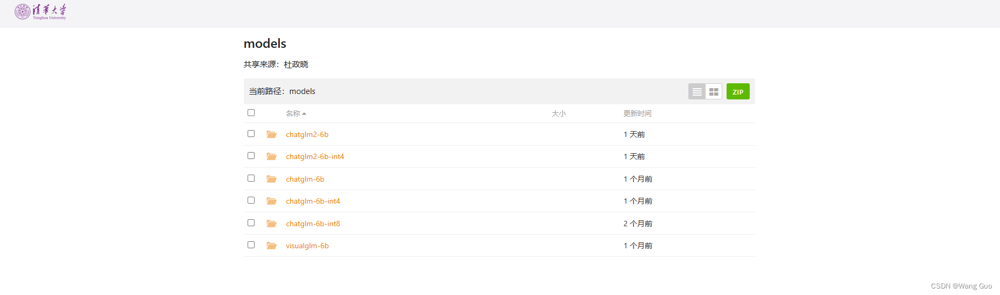
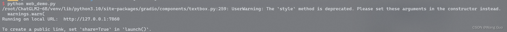
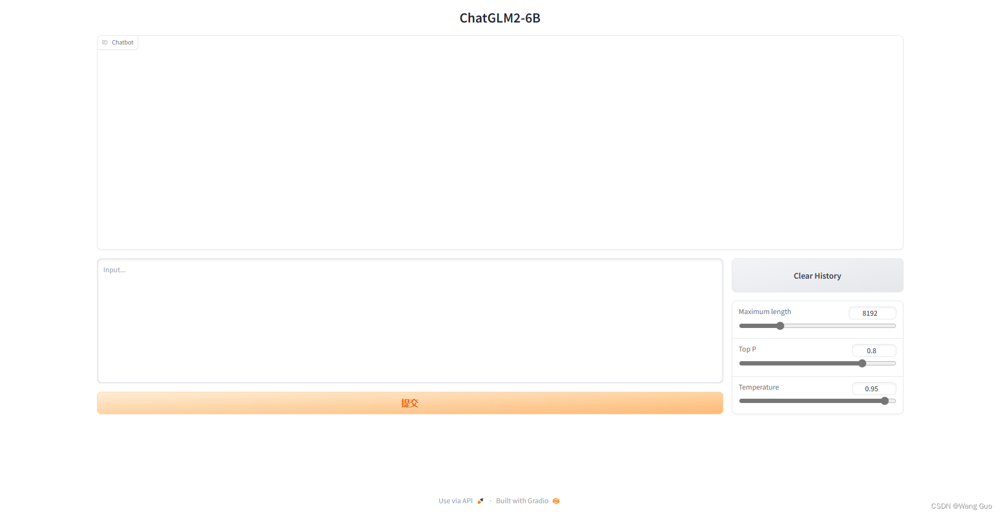
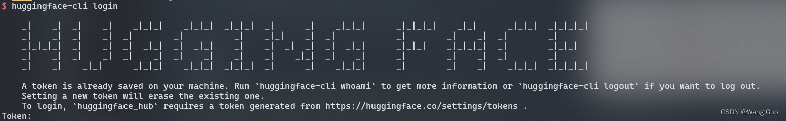
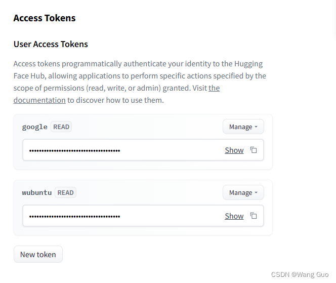
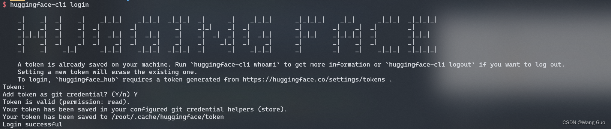

> ChatGLM2-6B 是开源中英双语对话模型 ChatGLM-6B 的第二代版本
GitHub地址：https://github.com/THUDM/ChatGLM2-6B


#### 1、先看效果


#### 2、ChatGLM2-6B新特性

- 更强大的性能：基于 ChatGLM 初代模型的开发经验，我们全面升级了 ChatGLM2-6B 的基座模型。ChatGLM2-6B 使用了 GLM 的混合目标函数，经过了 1.4T 中英标识符的预训练与人类偏好对齐训练，评测结果显示，相比于初代模型，ChatGLM2-6B 在 MMLU（+23%）、CEval（+33%）、GSM8K（+571%） 、BBH（+60%）等数据集上的性能取得了大幅度的提升，在同尺寸开源模型中具有较强的竞争力。

- 更长的上下文：基于 FlashAttention 技术，我们将基座模型的上下文长度（Context Length）由 ChatGLM-6B 的 2K 扩展到了 32K，并在对话阶段使用 8K 的上下文长度训练，允许更多轮次的对话。但当前版本的 ChatGLM2-6B 对单轮超长文档的理解能力有限，我们会在后续迭代升级中着重进行优化。

- 更高效的推理：基于 Multi-Query Attention 技术，ChatGLM2-6B 有更高效的推理速度和更低的显存占用：在官方的模型实现下，推理速度相比初代提升了 42%，INT4 量化下，6G 显存支持的对话长度由 1K 提升到了 8K。

- 更开放的协议：ChatGLM2-6B 权重对学术研究完全开放，在获得官方的书面许可后，亦允许商业使用。如果您发现我们的开源模型对您的业务有用，我们欢迎您对下一代模型 ChatGLM3 研发的捐赠。


#### 3、本地部署(ChatGLM2-6B-int4)

##### 部署环境
```
wsl2-ubuntu22.04 LTS

+-----------------------------------------------------------------------------+
| NVIDIA-SMI 525.104      Driver Version: 528.79       CUDA Version: 12.0     |
|-------------------------------+----------------------+----------------------+
| GPU  Name        Persistence-M| Bus-Id        Disp.A | Volatile Uncorr. ECC |
| Fan  Temp  Perf  Pwr:Usage/Cap|         Memory-Usage | GPU-Util  Compute M. |
|                               |                      |               MIG M. |
|===============================+======================+======================|
|   0  NVIDIA GeForce ...  On   | 00000000:01:00.0  On |                  N/A |
| N/A   45C    P8     5W /  80W |    928MiB /  6144MiB |      3%      Default |
|                               |                      |                  N/A |
+-------------------------------+----------------------+----------------------+

+-----------------------------------------------------------------------------+
| Processes:                                                                  |
|  GPU   GI   CI        PID   Type   Process name                  GPU Memory |
|        ID   ID                                                   Usage      |
|=============================================================================|
|    0   N/A  N/A        23      G   /Xwayland                       N/A      |
+-----------------------------------------------------------------------------+
```

##### 下载
```shell
git clone https://github.com/THUDM/ChatGLM2-6B
cd ChatGLM2-6B
```

##### 创建虚拟环境，安装库
```shell
virtualenv venv
source venv/bin/activate

pip install -r requirements.txt
```

##### 本地模型下载
```shell
git clone https://huggingface.co/THUDM/chatglm2-6b-int4
```
然后在[清华大学云盘](https://cloud.tsinghua.edu.cn/d/674208019e314311ab5c/?p=%2F&mode=list)下载相应的模型参数文件,并将文件拷贝到chatglm2-6b-int4文件夹下




##### int-4推理

需要先修改web_demo.py,修改内容
```python
//第7行,修改为本地模型参数地址

# model = AutoModel.from_pretrained("THUDM/chatglm2-6b-int4", trust_remote_code=True).cuda()

model = AutoModel.from_pretrained("./chatglm2-6b-int4", trust_remote_code=True).cuda()

```


##### ```web_demo.py```

执行
```sheLL
python web_demo.py
```







##### 遇到的问题
> 问题1
```shell
OSError: model/chatglm2-6b is not a local folder and is not a valid model identifier listed on 'https://huggingface.co/models'
If this is a private repository, make sure to pass a token having permission to this repo with `use_auth_token` or log in with `huggingface-cli login` and pass `use_auth_token=True`.
```
-- 解决，输入
```
huggingface-cli login 
```


并点击链接生成**new token**,拷贝到shell中输入即可





> 问题2
```shell
RuntimeError: Internal: src/sentencepiece_processor.cc(1101) [model_proto->ParseFromArray(serialized.data(), serialized.size())]
```
-- 解决，输入
```shell
sudo apt install libcudart11.0 libcublaslt11
```

