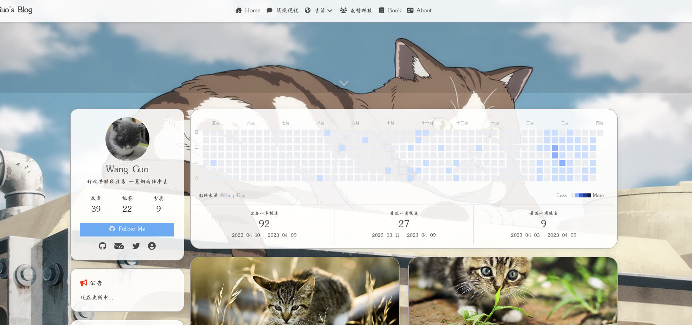
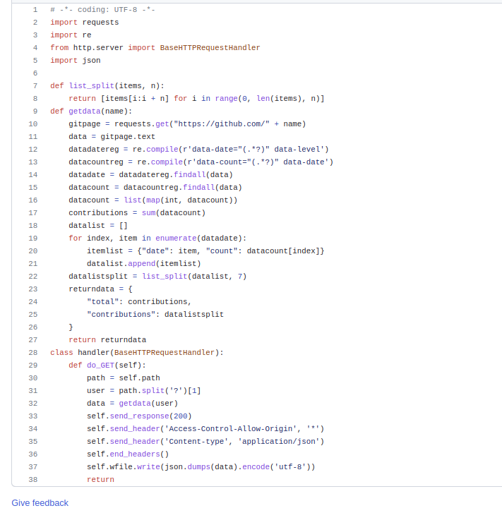
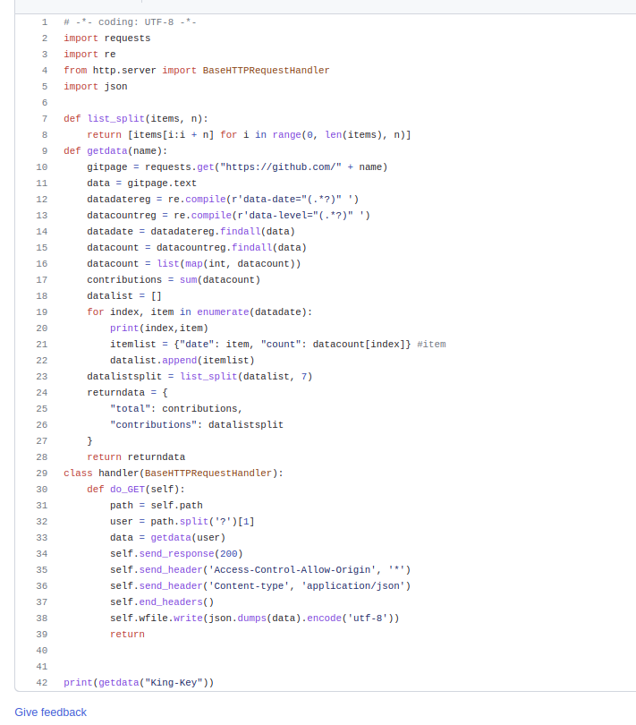
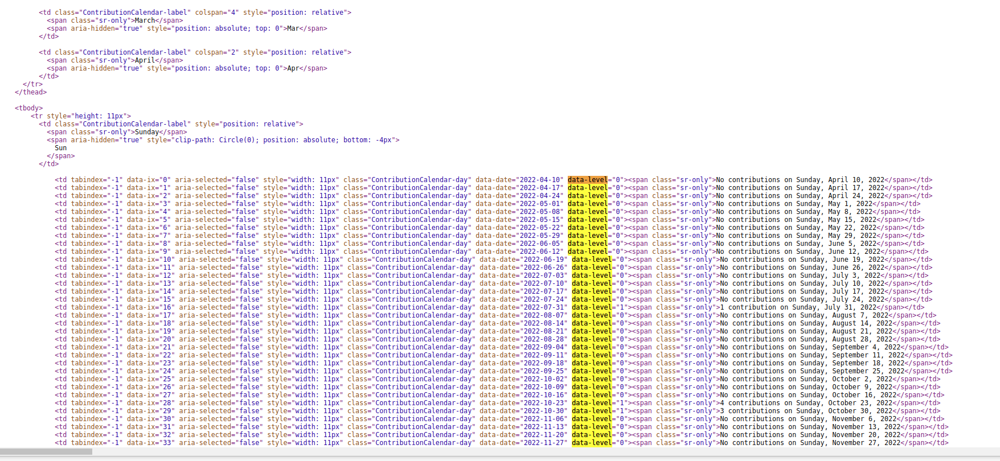

> 个性化博客

#### 1、先来看一下效果

[Wang Guo's Blog](https://King-Key.github.io/)




#### 2、安装

- 建议直接安装插件，省事也方便

```she
npm i hexo-githubcalendar --save
```

- 在博客项目根目录的```_config.yml```文件中添加

```yaml
# butterfly
githubcalendar:
  enable: true
  priority: 3
  enable_page: /
  user: [github name]
  layout:
    type: id
    name: recent-posts
    index: 0
  githubcalendar_html: '<div class="recent-post-item" style="width:100%;height:auto;padding:10px;"><div id="github_loading" style="height:100%;display: flex;align-items: center;justify-content: center;"><svg style="height:50px" xmlns="http://www.w3.org/2000/svg" xmlns:xlink="http://www.w3.org/1999/xlink"  viewBox="0 0 50 50" style="enable-background:new 0 0 50 50" xml:space="preserve"><path fill="#d0d0d0" d="M25.251,6.461c-10.318,0-18.683,8.365-18.683,18.683h4.068c0-8.071,6.543-14.615,14.615-14.615V6.461z" transform="rotate(275.098 25 25)"><animateTransform attributeType="xml" attributeName="transform" type="rotate" from="0 25 25" to="360 25 25" dur="0.6s" repeatCount="indefinite"></animateTransform></path></svg></div><div id="github_container"></div></div>'  pc_minheight: 248px
  mobile_minheight: 0px
  color: "['#ebedf0', '#c8e1ff', '#79b8ff', '#2188ff', '#0366d6', '#005cc5', '#044289', '#032f62', '#05264c']" #天青色调  
  api: [api link]
  calendar_js: https://cdn.jsdelivr.net/gh/Zfour/hexo-github-calendar@1.21/hexo_githubcalendar.js
  plus_style: ""
```

- ```hexo clean && hexo g && hexo s  ```三连即可

#### 3、最重要的

- ```user:```填写个人```github```账号名称即可
- 关键是```api```的问题 

首先，公用```api```不可用，只能自建；

其次，自建```api```的具体教程可以参考```https://github.com/Zfour/hexo-github-calendar```。但是个人在实际部署中发现，无法正常得到数据，经过排查后是发现这个项目里面的原代码有点小问题

| 原项目https://github.com/Zfour/hexo-github-calendar          | 本人修改后的https://github.com/King-Key/github_calendar_api  |
| ------------------------------------------------------------ | ------------------------------------------------------------ |
|  |  |

最主要的区别就是13行的代码，在```github```首页的源代码中，我们就可以找到这个值是```data-level```，```data-level```是要统计的提交次数。



原项目的得到的值是错误的，在实际部署后没法显示。所以大家可以在自建```api```的时候记得修改这个内容，或者也可以直接```fork```我的项目自建```api```进行部署。

https://github.com/King-Key/github_calendar_api
