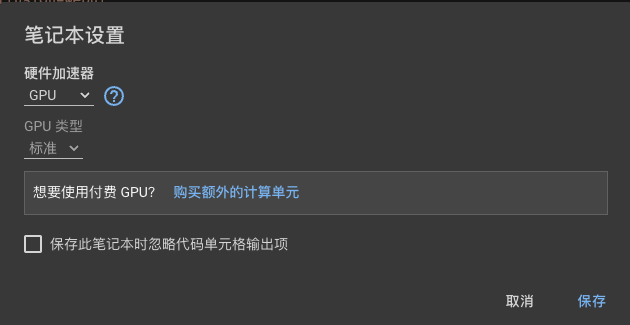
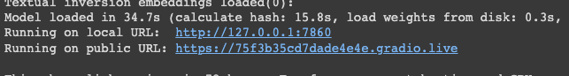

> 想要玩stable diffusion，算力不可少，白嫖google colab Tesla T4 GPU 玩转Stable Diffusion Webui

#### 1、google colab上安装stable diffusion webui

[](https://colab.research.google.com/drive/1qL5eD2VESnop8mrbFcHzMmfzqzmRMMF4?usp=sharing)


- 在google colab中新建```Stable Diffusion Webui googlecolab.ipynb```文件

- ```clone stable diffusion webui```项目

```python
!git clone https://github.com/AUTOMATIC1111/stable-diffusion-webui.git
%cd "/content/stable-diffusion-webui"
```

- 创建虚拟环境，并进入虚拟环境

```python
!pip install virtualenv
!virtualenv venv
!source venv/bin/activate
```

- 安装需要的环境

```python
!pip install -r requirements_versions.txt
!pip install torch==1.13.1+cu117 torchvision==0.14.1+cu117 torchtext==0.14.1 torchaudio==0.13.1 torchdata==0.5.1 --extra-index-url https://download.pytorch.org/whl/cu117
```

- 运行，不要忘记在```代码执行程程序``` 中 ```更改运行时类型```为```gpu```



```python
!python launch.py --gradio-queue --share
```



最后会生成一个public link，点击链接打开即可


#### 2、关于模型及下载

- [Civitai](https://civitai.com/)提供了很多模型，可以看看


##### - 可以在 [Hugging Face ](https://huggingface.co/) 搜索模型的下载地址（主要是这个提供下载地址，可以更方便的在google colab中执行）

```python
!git clone https://huggingface.co/luxluna/cuteGirlMix4_v10/resolve/main/cuteGirlMix4_v10.safetensors /content/stable-diffusion-webui/models/Stable-diffusion/cuteGirlMix4_v10.safetensors
```

##### -也可以挂载[Google 云盘](https://drive.google.com/drive/my-drive)，通过Google云盘上传模型

```Python
from google.colab import drive
drive.mount("/content/gdrive")

%mv /content/gdrive/MyDrive/ColabNotebooks/cuteGirlMix4_v10.safetensors /content/stable-diffusion-webui/models/Stable-diffusion/
```


#### 3、关于google colab中命令的使用

```%```: 目录操作

```!```: 执行操作
