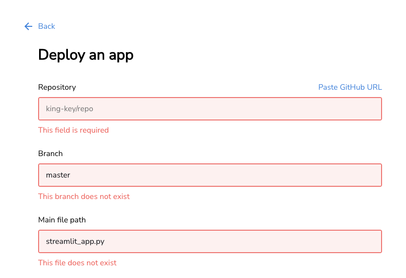
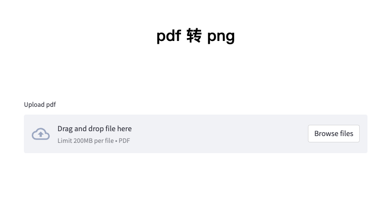

> 白嫖一个Cloud部署自己的算法程序


#### 1、github上创建部署的项目

项目包括```streamlit```执行文件和```requirements.txt```文件。```requirements.txt```文件的创建可以参考[Python中一些好用的扩展包](https://wangguo.site/posts/77b56ada.html)中```pipreqs```的用法。

```github```上的项目

 </br>

#### 2、Streamlit Cloud上部署项目

[Streamlit Cloud](https://share.streamlit.io/) 地址：[https://share.streamlit.io/](https://share.streamlit.io/)

- 点击```new app```-```from existing repo```


- 从github中选择要部署的项目



- 最后进行部署即可

部署成功后，会提供一个地址，点击进入就可以使用了


#### 3、部署的pdf2png项目

[](https://king-key-pdf2png-streamlit-app-kwictz.streamlit.app)


<center>点击图片可以跳转使用！</center>


