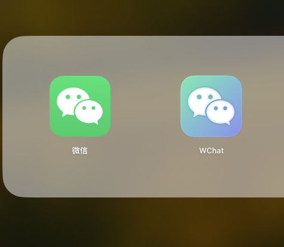
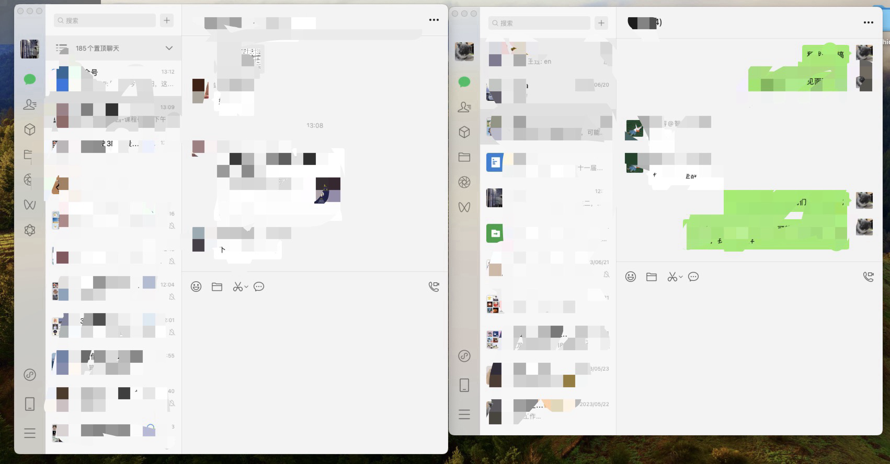
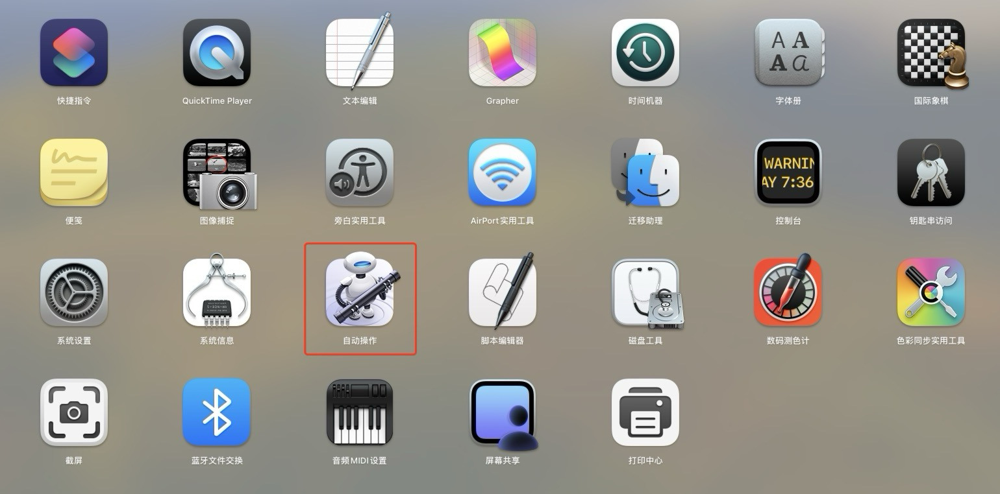
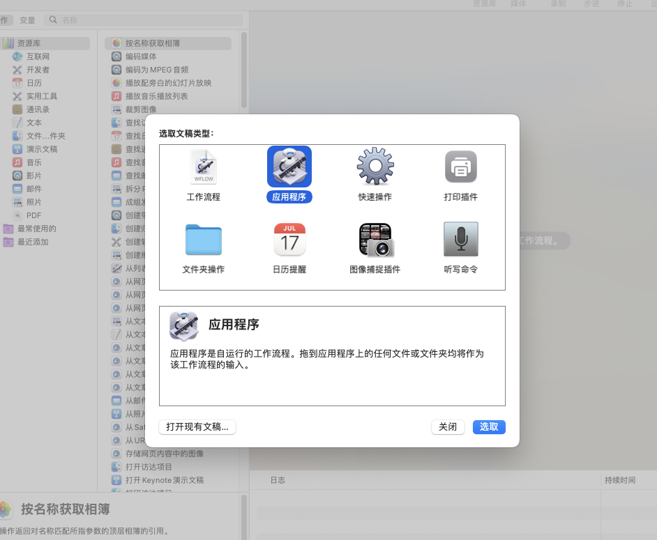
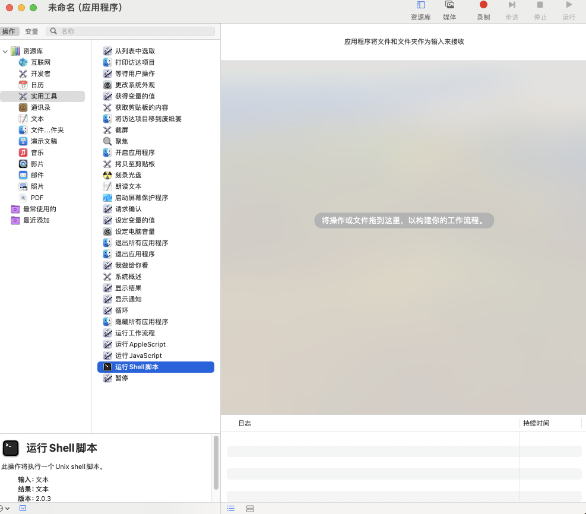
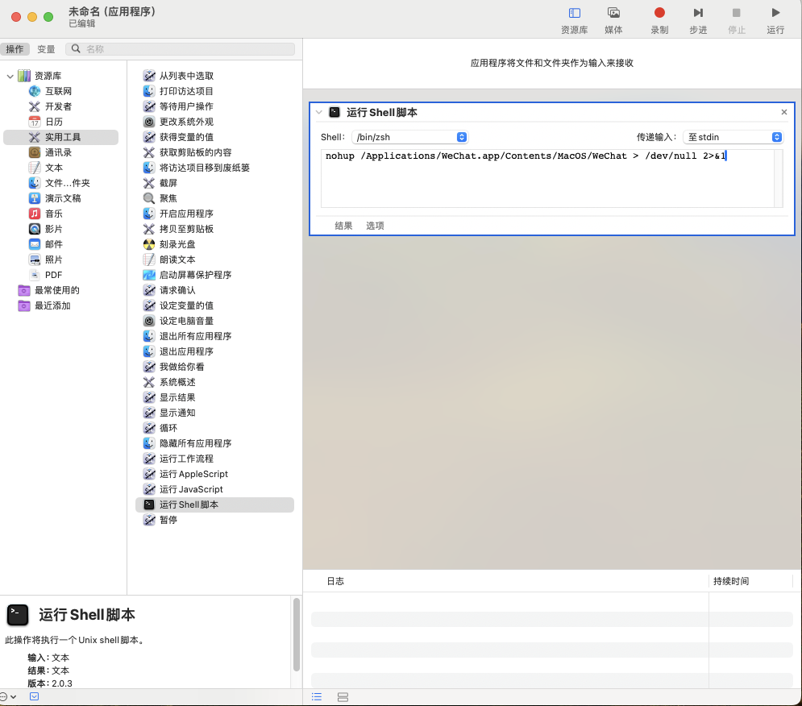
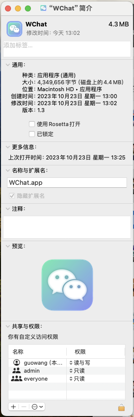

> 通过Mac上的“自动操作”和一行代码实现图像化的Mac双开

<!--more-->


## 1、先看看效果



## 2、Mac上，一行命令解决微信双开的问题

```shell
nohup /Applications/WeChat.app/Contents/MacOS/WeChat > /dev/null 2>&1
```

但是每次通过命令行去操作也太过麻烦，最好的方式还是加一个图标，和正常的应用程序一样，点击图标执行最好。

## 3、利用“自动操作”，创建双开微信App

- 打开“自动操作”



- “应用程序”-新建文稿



- “实用工具”-“运行shell脚本”-创建文件



- 复制双开命令，保存为“应用程序”



- 右键“显示简介”，点击图标进行替换即可



## 4、图标

也可以找其他图标进行替换

