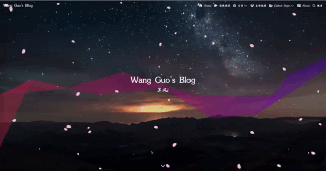

> 博客美化继续

<!--more-->

#### 1、先来看看效果



#### 2、实现方法

在```themes/butterfly/_config.yml```文件中找到```buttom```添加以下内容:

```shell
- <script async src="https://npm.elemecdn.com/tzy-blog/lib/js/other/sakura.js"></script>
```