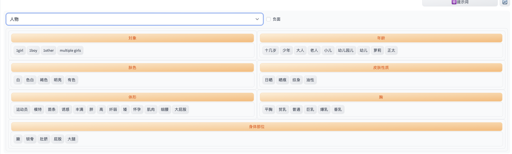

> AIGC绘画提示词应该怎么写

<!--more-->
## 1、基本

- 提示词由多个单词、词组和短句组成，用逗号分开
- 分为正向提示词`positive prompt`和反向提示词`negative prompt`
- 权重：
  - 范围0.1-100，默认为1，低于1是减弱，大于1是增强
  - 顺序影响权重，按照顺序依次减弱
  - 权重比例相对，3:1 = 6:2
- 顺序
  - 明确主题：画面质量->主要元素->细节
  - 明确风格：画面质量->风格->元素->细节
  - 景色在前，人物会变小，反之亦然
  - 参考顺序
    - ```画面质量，风格，主题，外表（发型、发色、衣服、眼睛、手臂、胸部、腿部....），情绪，姿势，背景```
    - ```（画面质量+风格+镜头效果+光照效果+主题+构图）+ 主体（人物&对象+姿势+服装+道具）+ 细节（场景+环境+饰品+特征）```
- 符号（可以用来改变提示词的权重）

| 符号 |      介绍      |         格式          | eg                                      |
| :--: | :------------: | :-------------------: | --------------------------------------- |
|  :   | 自定义权重比例 |    （prompt:数字）    | （girl:0.8），权重0.8                   |
| and  |    权重一致    |                       |                                         |
|  \|  |    交替渲染    |                       |                                         |
|  <>  |  调用Lora模型  | <lora:filename:数字>  |                                         |
|  []  |    交替渲染    | [prompt1:prompt2:0.5] | prompt1渲染到50%的时候，渲染开始prompt2 |
|      |      融合      |  [prompt1｜prompt2]   | 融合1和2                                |

- 命令参数

|          命令           |     解释     |
| :---------------------: | :----------: |
|      --seed number      |     种子     |
| --aspect number: number |    宽高比    |
|    --version number     |     版本     |
|     --chaos number      |    多样性    |
|    --quality number     |     质量     |
|       --sameseed        |    相似值    |
|         --stop          |     停止     |
|    --stylize number     |    风格化    |
|          --iw           |   图像权重   |
|        --uplight        |  轻量放大器  |
|        --upbeta         | 测试版放大器 |
|         --niji          |   动漫模型   |
|         --test          |   测试模型   |
|         --testp         | 摄影测试模型 |
|          --hd           |   高清模型   |
|     --repeat number     |     重复     |

参考：[https://id8ex69uxy.feishu.cn/wiki/wikcn6VV58f94Wwt4hNuy7xex3e](https://id8ex69uxy.feishu.cn/wiki/wikcn6VV58f94Wwt4hNuy7xex3e)

## 2、提示词

|   分类   |                            提示词                            |
| :------: | :----------------------------------------------------------: |
| 动作姿势 | Arms Wide Open (双臂张开)<br />Leaning Forward (身体前倾，像鞠躬那样)<br />Sitting on a Chair(坐在椅子上)<br />Hand on Hip (手叉腰)<br />Hand in Pocket (手插兜)<br />Crossed Arms (双臂交叉)<br />Crossed Legs (翘二郎腿)<br />Kneeling (跪地)<br />Hands Up (双手举起来)<br />Arms Up (双臂高举)<br />Arms Behind Back (双臂放在身后)<br />Salute (敬礼)<br />Jumping (跳跃)<br />All Fours (四肢着地，爬行姿势)<br />Yoga Pose (瑜伽姿势)<br />High Kicks (高踢腿)<br />Leaning Against a Wall (靠在墙上)<br />Looking Back Over Shoulder (回头看)<br />Running (跑步)<br />Squatting（蹲着）<br />Catwalk Pose (T型台走秀姿势)<br />Hand Wave (挥手)<br />Fighting Stance(战斗姿势)<br />Standing on One Leg (单腿站立) |
|          |                                                              |

## 3、提示词插件

- [stable-diffusion-webui-wd14-tagger](https://github.com/picobyte/stable-diffusion-webui-wd14-tagger)

可以根据图片反推提示词


- [sd-prompt-translator](https://github.com/studyzy/sd-prompt-translator)

汉化后的提示词选择器



- [sdweb-easy-prompt-selector](https://github.com/lijialong1313/sdweb-easy-prompt-selector)

提示词翻译插件，可以直接用中文写提示词


## 4、关于分辨率 
- 正方形（1024x1024）： 这是默认分辨率，适合大多数普通图像。
- 宽屏（1792x1024）： 适合风景、全景或任何需要水平方向的图像。
- 高（1024x1792）： 最适合全身肖像、高大结构或任何需要垂直方向的图像。