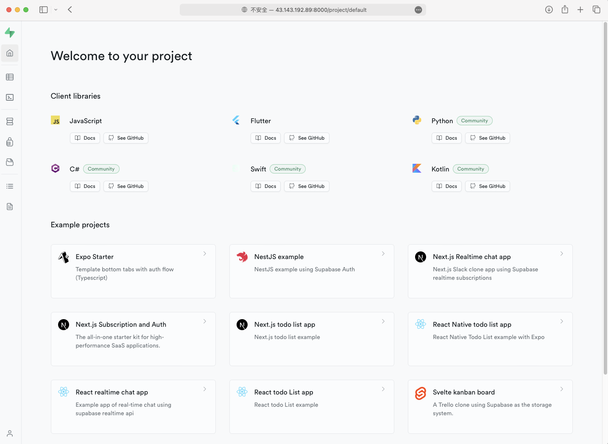

> 矢量数据库的安装

<!--more-->

###  supabase安装 [^1]



- 问题1

```shell
docker: 'compose' is not a docker command. See 'docker --help'
```

解决

```shell
sudo curl -L "https://github.com/docker/compose/releases/download/v2.6.1/docker-compose-$(uname -s)-$(uname -m)" -o /usr/local/bin/docker-compose

sudo chmod +x /usr/local/bin/docker-compose
```

- 问题2

```shell
error getting credentials - err: exit status 1, out: `Cannot autolaunch D-Bus without X11 $DISPLAY`
```

解决

```shell
sudo apt-get install pass gnupg2
```

参考链接：

[^1]: https://supabase.com/docs/guides/self-hosting/docker#running-supabase
