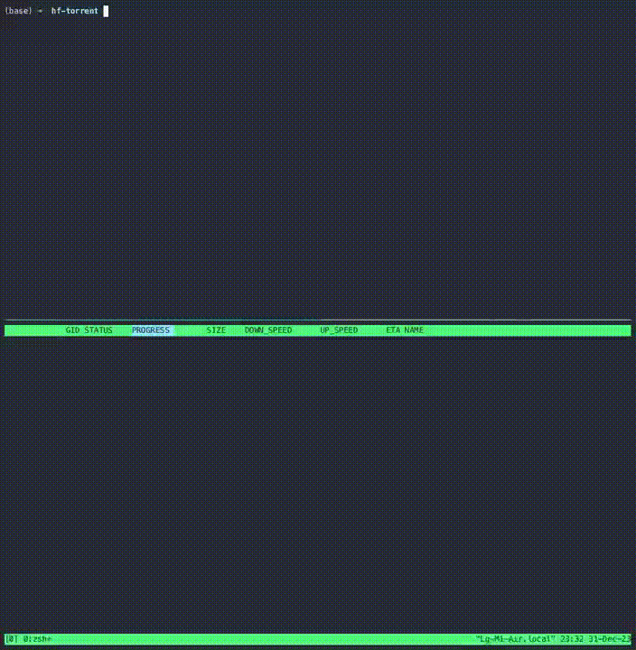

> 用种子协议下载Huggingface模型

<!--more-->

多年后提起 2023 时，一个不可避免的关键词肯定是「大模型」。在各种大模型科研如火如荼展开的同时，大模型下载也成为了很多人的烦恼。Huggingface 每月仅模型的下载流量就超过了 10PB。

为此，MIT 的朱力耕博士开发了一个叫做 HF-Torrent 的工具，可以使用种子协议（Torrent）以P2P形式进行下载。希望大家在2024年的出版物和模型大小一样都能节节高🎆！

### Demo展示



### 如何使用

```shell
pip install hf-torrent
```

在启动下载之前，请确保您已安装**[aria2c](https://aria2.github.io/)**并在单独的终端中运行以下命令

```shell
aria2c --enable-rpc --rpc-listen-all \
    --max-upload-limit=4M \
    --optimize-concurrent-downloads=true \
    --bt-detach-seed-only=true \
    --seed-ratio=10.0  
```

然后，可以使用以下命令开始使用HF-Torrent：

```shell
hf-torrent <your target repo>
```

或者，如果您有喜欢的种子客户端，只需要提取种子文件

```shell
hf-torrent --get-torrent <your target repo>
```

### 项目地址

https://github.com/lyken17/hf-torrent
