> 没有微信限制

<!--more-->

### 先看效果

- 左：单人回复；右：社群回复

| 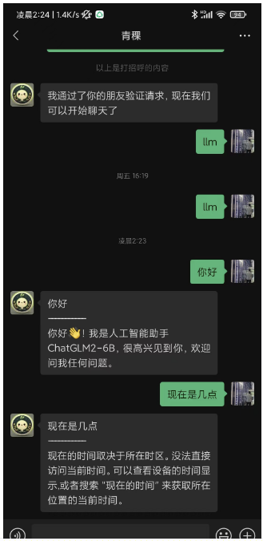 | 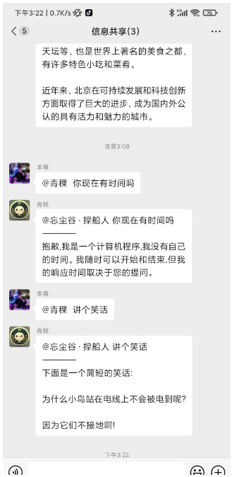 |
| ------------------------------------------------------------ | ------------------------------------------------------------ |


### [ChatGLM2-6B-int4](https://github.com/THUDM/ChatGLM2-6B)本地部署

本地部署教程之前写过，按照这个来即可：https://wangguo.site/posts/9d8c1768.html

这个是运行web_demo.py的效果


这次运行openai_api.py，启动接口服务

```shell
python openai_api.py
```

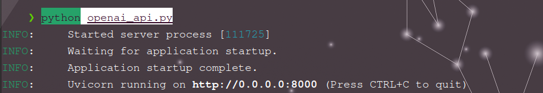

### [One-API](https://github.com/songquanpeng/one-api)接入ChatGLM2-6B-int4的OpenAI服务接口

参考：[https://doc.fastgpt.in/docs/development/one-api/](https://doc.fastgpt.in/docs/development/one-api/)

#### 基于docker进行部署即可，只需要一条命令

```shell
docker run --name one-api -d --restart always -p 13000:3000 -e TZ=Asia/Shanghai -v /home/ubuntu/data/one-api:/data justsong/one-api
```

- -p，这里用了本地的13000端口，也可以调整
- -v，是指数据和日志的保存目录，也可以调整

#### 安装完成后，打开```http://localhost:13000```

- 默认账号：root
- 密码：123456

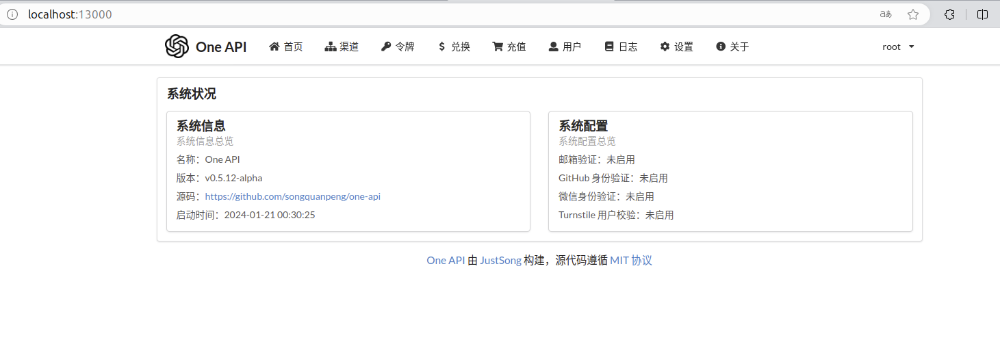

#### 点击**渠道** -> **添加新的渠道**，按照如下进行配置并进行**提交**

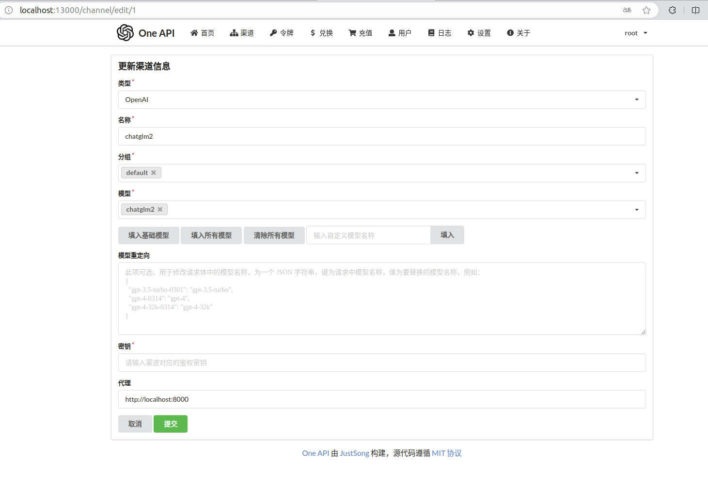

- 类型：OpenAI，这个是固定的
- 名称：chatglm2，这个随意
- 模型：chatglm2，这个通过“输入自定义模型名称”来输入，这个名称是后面FastGPT里面会显示的名称
- 代理：本地ChatGLM2-6B-int4的接口服务地址

#### 点击**令牌**-> **添加新的令牌**

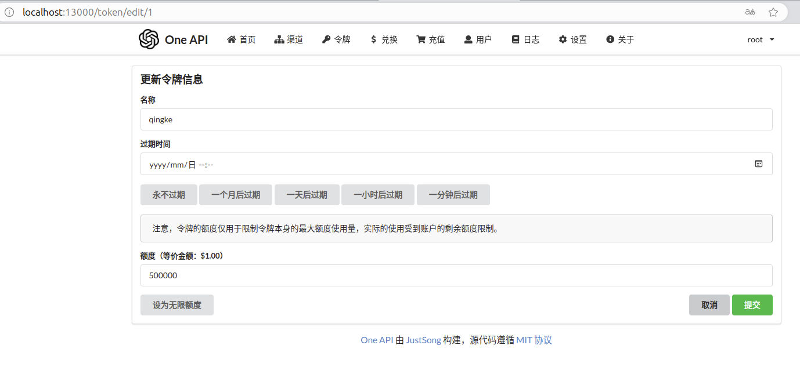

- 名称等信息随便写即可，最后点击这里的**复制**，可以拷贝令牌（后面要用到）

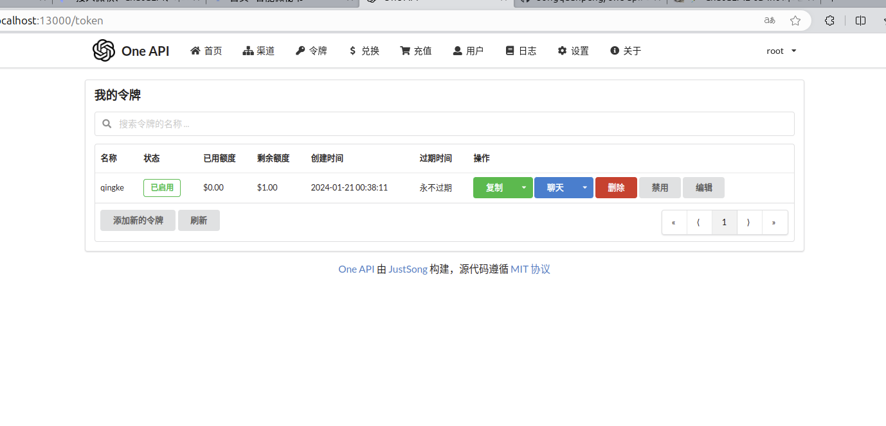

### [FastGPT](https://github.com/labring/FastGPT)通过One-API接入本地模型ChatGLM2-6B-int4

#### Docker Compose快速部署

参考：[https://doc.fastgpt.in/docs/development/docker/](https://doc.fastgpt.in/docs/development/docker/)

```shell
mkdir fastgpt
cd fastgpt
curl -O https://raw.githubusercontent.com/labring/FastGPT/main/files/deploy/fastgpt/docker-compose.yml
curl -O https://raw.githubusercontent.com/labring/FastGPT/main/projects/app/data/config.json
```

#### 在docker-compose.yml修改 FastGPT 的环境变量(第52行)

```yml
- OPENAI_BASE_URL=http://192.168.1.14:8000/v1  //这里的IP地址用本地IPV4的地址，可用ifconfig查看
- CHAT_API_KEY=sk- //这里填入One-API里面的令牌
```

#### 在config.json中加入ChatGLM2

```json
"chatModels": [
    {
      "model": "chatglm2", 
      "name": "chatglm2", 
      "maxContext": 8000, 
      "maxResponse": 4000, 
      "quoteMaxToken": 2000, 
      "maxTemperature": 1, 
      "vision": false, 
      "defaultSystemChatPrompt": "" 
    },
```

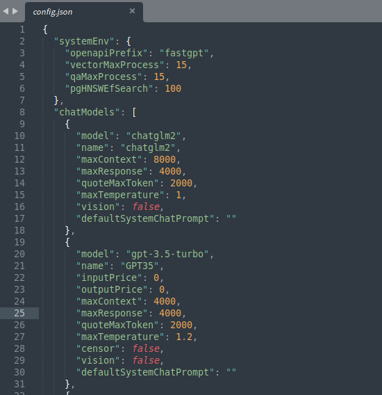

#### 启动容器

```shell
docker-compose pull
docker-compose up -d
```

#### 通过http://localhost:3000进入FastGPT

- 默认账号：root
- 密码：1234

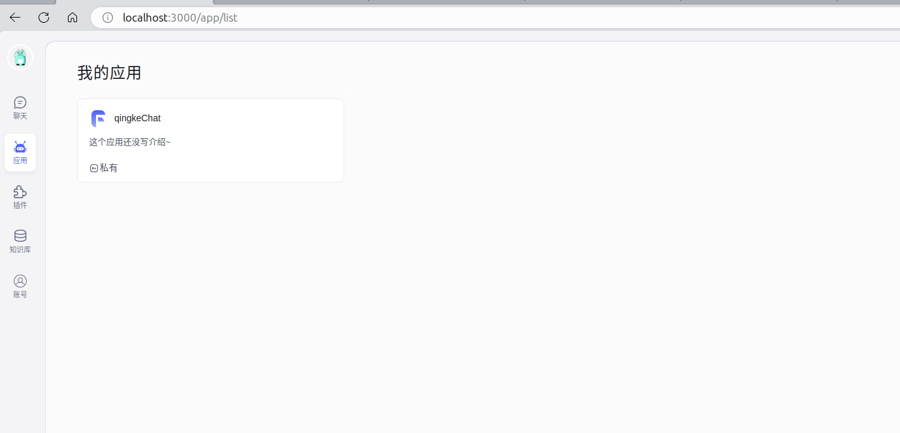

#### 创建ChatGLM2应用

- 应用 -> 新建

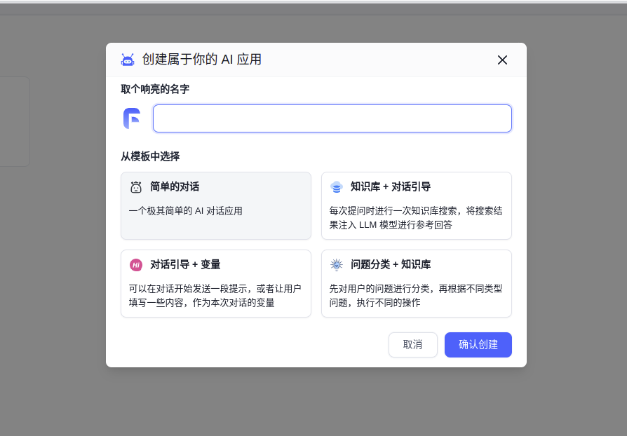

- **AI模型**选择**ChatGLM2**

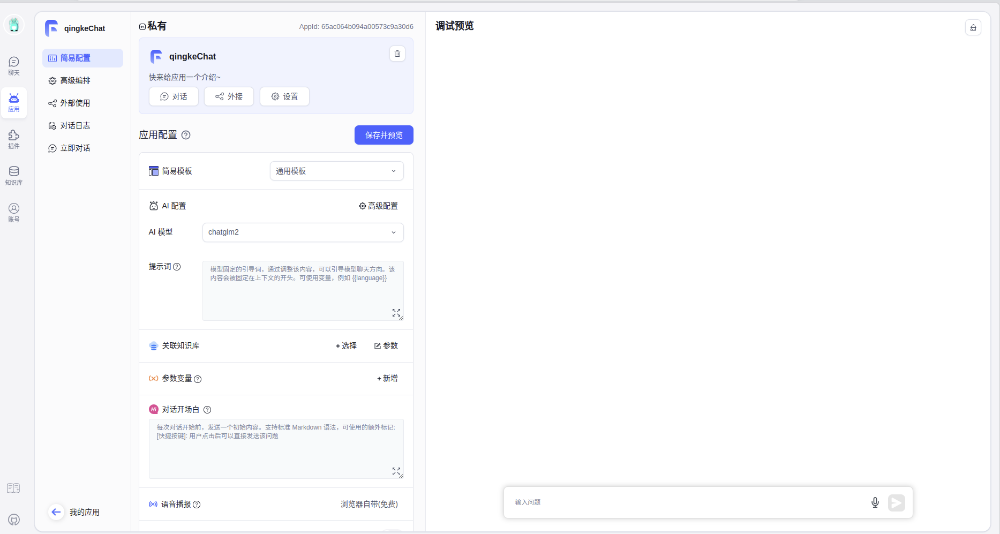

#### 测试

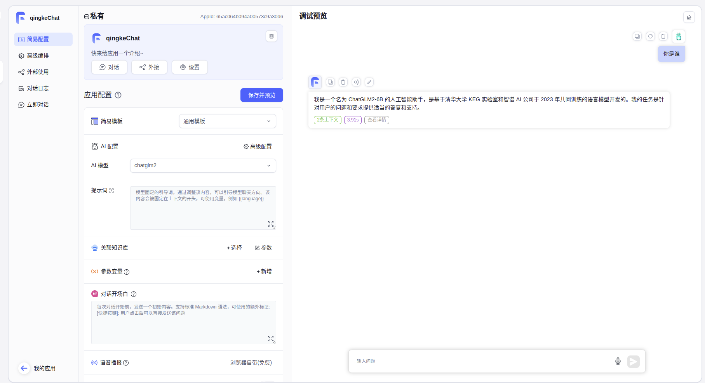

#### 在FastGPT创建的应用里面，选择**外部使用** -> **API访问**

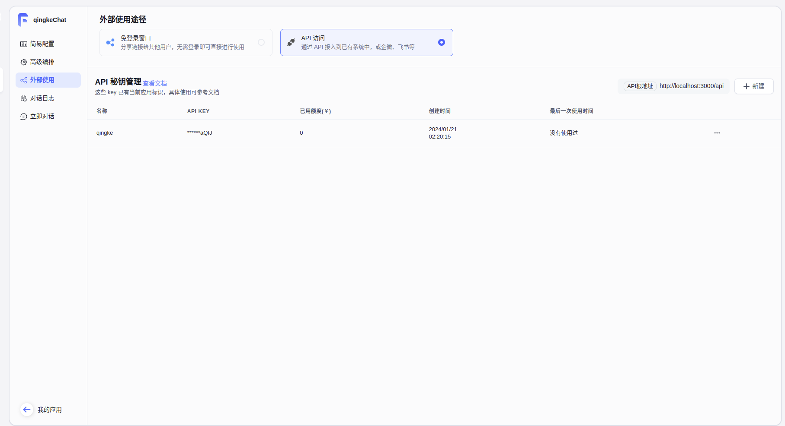

#### **新建**API密钥管理，名称随意，拷贝这个密钥

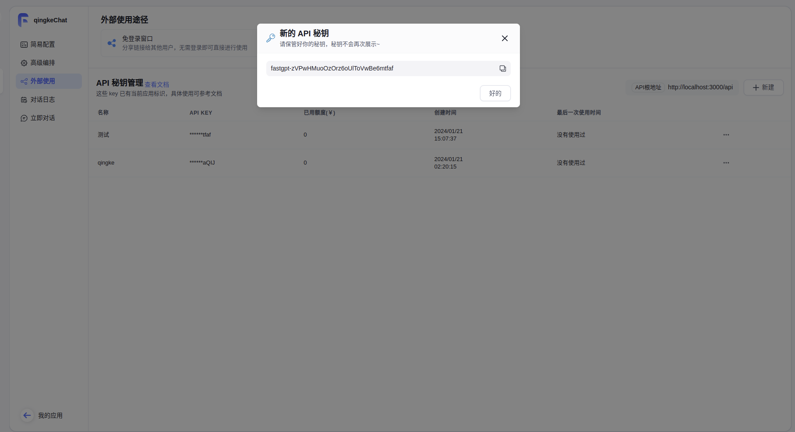

### 智能微秘书接入FastGPT中的ChatGLM2-6B-int4

参考：[https://doc.fastgpt.in/docs/use-cases/wechat/](https://doc.fastgpt.in/docs/use-cases/wechat/)

#### 配置微秘书

- 打开[微秘书](https://wechat.aibotk.com/?r=zWLnZK) 注册登陆后找到菜单栏「基础配置」->「智能配置」，选择**智能机器人回复**，如下配置。这里的apikey就是刚才FastGPT中拷贝的

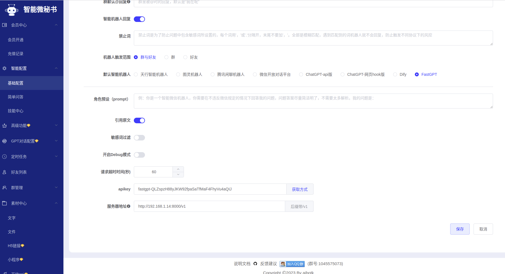

#### Docker部署智能微秘书客户端

```shell
docker pull aibotk/wechat-assistant
docker run -d -e AIBOTK_KEY="微秘书apikey" -e AIBOTK_SECRET="微秘书apiSecret" --name=wechatbot aibotk/wechat-assistant
```

- 微秘书apikey和微秘书apiSecret可以在个人中心中获得

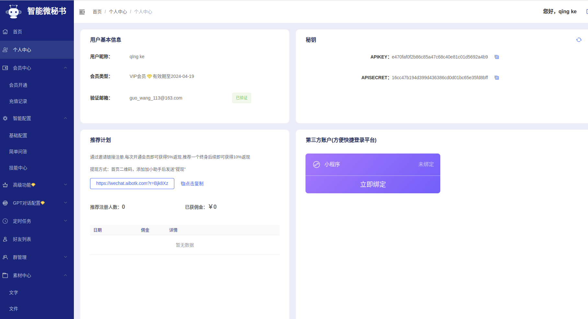

#### 进入**首页**扫码登陆微信，结束！

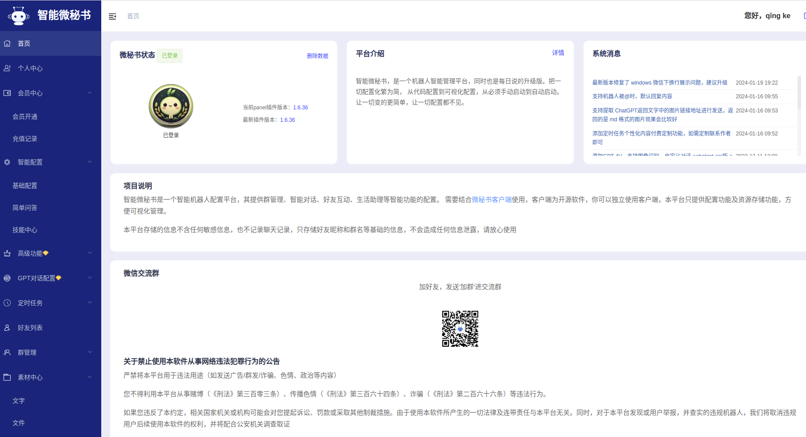

### 问题总结

- 问题：chatglm的openAPI报错

```shell
ERROR:    Exception in ASGI application
Traceback (most recent call last):
  File "/home/guo/Desktop/ChatGLM2-6B-main/venv/lib/python3.11/site-packages/sse_starlette/sse.py", line 269, in __call__
    await wrap(partial(self.listen_for_disconnect, receive))
  File "/home/guo/Desktop/ChatGLM2-6B-main/venv/lib/python3.11/site-packages/sse_starlette/sse.py", line 258, in wrap
    await func()
  File "/home/guo/Desktop/ChatGLM2-6B-main/venv/lib/python3.11/site-packages/sse_starlette/sse.py", line 215, in listen_for_disconnect
    message = await receive()
              ^^^^^^^^^^^^^^^
  File "/home/guo/Desktop/ChatGLM2-6B-main/venv/lib/python3.11/site-packages/uvicorn/protocols/http/h11_impl.py", line 534, in receive
    await self.message_event.wait()
  File "/usr/lib/python3.11/asyncio/locks.py", line 213, in wait
    await fut
asyncio.exceptions.CancelledError: Cancelled by cancel scope 7fbe7b1b8f50

During handling of the above exception, another exception occurred:

  + Exception Group Traceback (most recent call last):
  |   File "/home/guo/Desktop/ChatGLM2-6B-main/venv/lib/python3.11/site-packages/uvicorn/protocols/http/h11_impl.py", line 404, in run_asgi
  |     result = await app(  # type: ignore[func-returns-value]
  |              ^^^^^^^^^^^^^^^^^^^^^^^^^^^^^^^^^^^^^^^^^^^^^^
  |   File "/home/guo/Desktop/ChatGLM2-6B-main/venv/lib/python3.11/site-packages/uvicorn/middleware/proxy_headers.py", line 84, in __call__
  |     return await self.app(scope, receive, send)
  |            ^^^^^^^^^^^^^^^^^^^^^^^^^^^^^^^^^^^^
  |   File "/home/guo/Desktop/ChatGLM2-6B-main/venv/lib/python3.11/site-packages/fastapi/applications.py", line 1054, in __call__
  |     await super().__call__(scope, receive, send)
  |   File "/home/guo/Desktop/ChatGLM2-6B-main/venv/lib/python3.11/site-packages/starlette/applications.py", line 123, in __call__
  |     await self.middleware_stack(scope, receive, send)
  |   File "/home/guo/Desktop/ChatGLM2-6B-main/venv/lib/python3.11/site-packages/starlette/middleware/errors.py", line 186, in __call__
  |     raise exc
  |   File "/home/guo/Desktop/ChatGLM2-6B-main/venv/lib/python3.11/site-packages/starlette/middleware/errors.py", line 164, in __call__
  |     await self.app(scope, receive, _send)
  |   File "/home/guo/Desktop/ChatGLM2-6B-main/venv/lib/python3.11/site-packages/starlette/middleware/cors.py", line 83, in __call__
  |     await self.app(scope, receive, send)
  |   File "/home/guo/Desktop/ChatGLM2-6B-main/venv/lib/python3.11/site-packages/starlette/middleware/exceptions.py", line 62, in __call__
  |     await wrap_app_handling_exceptions(self.app, conn)(scope, receive, send)
  |   File "/home/guo/Desktop/ChatGLM2-6B-main/venv/lib/python3.11/site-packages/starlette/_exception_handler.py", line 64, in wrapped_app
  |     raise exc
  |   File "/home/guo/Desktop/ChatGLM2-6B-main/venv/lib/python3.11/site-packages/starlette/_exception_handler.py", line 53, in wrapped_app
  |     await app(scope, receive, sender)
  |   File "/home/guo/Desktop/ChatGLM2-6B-main/venv/lib/python3.11/site-packages/starlette/routing.py", line 762, in __call__
  |     await self.middleware_stack(scope, receive, send)
  |   File "/home/guo/Desktop/ChatGLM2-6B-main/venv/lib/python3.11/site-packages/starlette/routing.py", line 782, in app
  |     await route.handle(scope, receive, send)
  |   File "/home/guo/Desktop/ChatGLM2-6B-main/venv/lib/python3.11/site-packages/starlette/routing.py", line 297, in handle
  |     await self.app(scope, receive, send)
  |   File "/home/guo/Desktop/ChatGLM2-6B-main/venv/lib/python3.11/site-packages/starlette/routing.py", line 77, in app
  |     await wrap_app_handling_exceptions(app, request)(scope, receive, send)
  |   File "/home/guo/Desktop/ChatGLM2-6B-main/venv/lib/python3.11/site-packages/starlette/_exception_handler.py", line 64, in wrapped_app
  |     raise exc
  |   File "/home/guo/Desktop/ChatGLM2-6B-main/venv/lib/python3.11/site-packages/starlette/_exception_handler.py", line 53, in wrapped_app
  |     await app(scope, receive, sender)
  |   File "/home/guo/Desktop/ChatGLM2-6B-main/venv/lib/python3.11/site-packages/starlette/routing.py", line 75, in app
  |     await response(scope, receive, send)
  |   File "/home/guo/Desktop/ChatGLM2-6B-main/venv/lib/python3.11/site-packages/sse_starlette/sse.py", line 255, in __call__
  |     async with anyio.create_task_group() as task_group:
  |   File "/home/guo/Desktop/ChatGLM2-6B-main/venv/lib/python3.11/site-packages/anyio/_backends/_asyncio.py", line 678, in __aexit__
  |     raise BaseExceptionGroup(
  | ExceptionGroup: unhandled errors in a TaskGroup (1 sub-exception)
  +-+---------------- 1 ----------------
    | Traceback (most recent call last):
    |   File "/home/guo/Desktop/ChatGLM2-6B-main/venv/lib/python3.11/site-packages/sse_starlette/sse.py", line 258, in wrap
    |     await func()
    |   File "/home/guo/Desktop/ChatGLM2-6B-main/venv/lib/python3.11/site-packages/sse_starlette/sse.py", line 245, in stream_response
    |     async for data in self.body_iterator:
    |   File "/home/guo/Desktop/ChatGLM2-6B-main/openai_api.py", line 138, in predict
    |     yield "{}".format(chunk.model_dump_json(exclude_unset=True,exclude_none=True))
    |                       ^^^^^^^^^^^^^^^^^^^^^^^^^^^^^^^^^^^^^^^^^^^^^^^^^^
    |   File "/home/guo/Desktop/ChatGLM2-6B-main/venv/lib/python3.11/site-packages/typing_extensions.py", line 2499, in wrapper
    |     return arg(*args, **kwargs)
    |            ^^^^^^^^^^^^^^^^^^^^
    |   File "/home/guo/Desktop/ChatGLM2-6B-main/venv/lib/python3.11/site-packages/pydantic/main.py", line 1011, in json
    |     raise TypeError('`dumps_kwargs` keyword arguments are no longer supported.')
    | TypeError: `dumps_kwargs` keyword arguments are no longer supported.
    +------------------------------------
^CINFO:     Shutting down
INFO:     Waiting for application shutdown.
INFO:     Application shutdown complete.
INFO:     Finished server process [109773]

```

解决：参考[https://github.com/THUDM/ChatGLM2-6B/issues/483](https://github.com/THUDM/ChatGLM2-6B/issues/483)

将openai_api.py文件中3处

```
chunk.json(exclude_unset=True, ensure_ascii=False)
```

替换为

```
chunk.model_dump_json(exclude_unset=True,exclude_none=True)
```
