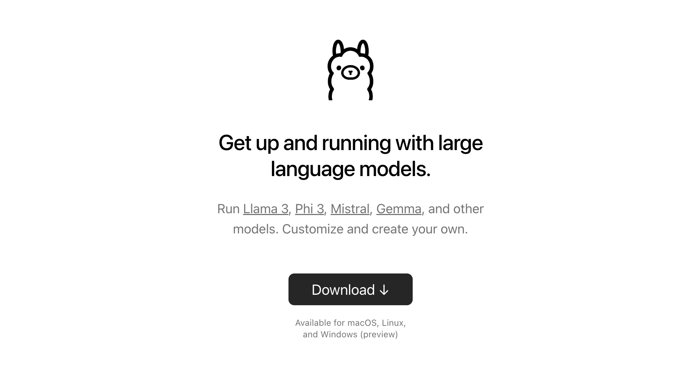

## 1、[ollama](https://github.com/ollama/ollama)安装使用
### 1.1、[ollama](https://github.com/ollama/ollama)

> Get up and running with large language models locally.

### 1.2、支持的[模型列表](https://ollama.com/library)


### 1.3、[下载](https://ollama.com/download)安装

### 1.4、使用（基于终端操作）
#### 1.4.1、下载模型(以llama3为例)
```
ollama pull llama3 #llama3默认是8B的模型
```
下载需要等待一段时间，同时也需要科学上网
#### 1.4.2、使用模型
```
ollama run llama3
```

## 2、obsidian中使用ollama

### 2.1、obsidian插件[copilot](https://github.com/logancyang/obsidian-copilot)

插件市场搜索copilot进行安装并启用


### 2.2、copilot中配置ollama

打开copilot的配置文件进行设置
#### 2.2.1、default model修改为ollama

#### 2.2.2、QA Setting设置为ollama-nomic-embed-text
需要先用ollama pull命令下载模型
```
ollama pull ollama-nomic-embed-text
```

#### 2.2.3、ollama设置model为llama3

## 3、obsidian中使用llama3
### 3.1、执行ollama serve
此时需要关闭之前打开的ollama，重新用命令打开ollama
```
OLLAMA_ORIGINS=app://obsidian.md* ollama serve
```
### 3.2、obsidian使用
- 打开copilot对话窗口

- 设置为ollama

- 使用

### 3.3、copilot中除了对话功能还有Long Note QA、Vault QA功能，可以继续探索使用一下
