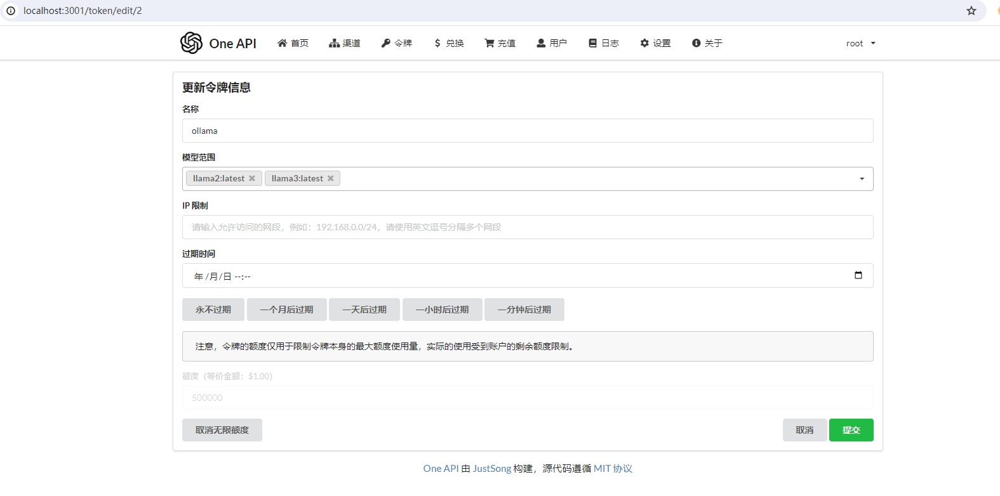

> 之前使用的**微秘书**对微信接口收费了，没法免费接入大模型。只能换成chatgpt-on-wechat接入了

### 往期参考文章

1、 [FastGPT,ChatGLM2,WeChat本地化部署实战](https://king-key.github.io/Blog/2024/Q1/fastgpt-chatglm2-wechat/)

2、[obsidian中使用ollama部署llama3,实现本地对话](https://king-key.github.io/Blog/2024/Q2/2024-05-09/)


##  1、ollama安装

ollama安装参考：[obsidian中使用ollama部署llama3,实现本地对话](https://wangguo.site/Blog/2024/Q2/2024-05-09/#wow0)中的第一小节

### 1.1、下载对应版本[ollama](https://ollama.com/download)进行安装


### 1.2、在终端中使用ollama

常用命令

```shell
ollama pull [模型名称]  //下载模型
ollama run [模型名称]  //运行模型
ollama serve //启动ollama api服务
```

- 要```pull```的模型可以在ollama的[模型仓库](https://ollama.com/library)中查看


- 要```run```的模型可以通过```ollama ls```查看


- ```ollama serve```之后，就可以通过```api```的方式调用ollama服务了


## 2、FastFPT中调用ollama

### 2.1、安装FastGPT

#### 安装

参考：[Docker Compose快速部署](https://wangguo.site/Blog/2024/Q1/fastgpt-chatglm2-wechat/#wow8)

```shell
mkdir fastgpt
cd fastgpt
curl -O https://raw.githubusercontent.com/labring/FastGPT/main/files/deploy/fastgpt/docker-compose.yml
curl -O https://raw.githubusercontent.com/labring/FastGPT/main/projects/app/data/config.json
```

#### 运行

```
docker-compose pull
docker-compose up -d
```


此时，我们可以在docker-desktop 中看到已经运行的fastgpt，其中已经自带运行了one-api

### 2.2、One API+ollama

参考：[One-API接入ChatGLM2-6B-int4的OpenAI服务接口](https://wangguo.site/Blog/2024/Q1/fastgpt-chatglm2-wechat/#wow8)

#### 登陆one api

浏览器端打开one api的网页界面```localhost:3001```

- 默认账号：root
- 密码：123456


#### 新建渠道


- 类型：OpenAI 即可
- 名称：随意
- 分组：default 即可
- 模型：选择```ollama ls```查看到的模型
- 密钥：随便填写一下就好，例如```sk-fastgpt```
- 代理：```ollama serve```的地址，一般情况下用本地ip+端口11434即可

#### 新建令牌



- 名称：随意
- 模型范围：选择渠道里面的模型即可

### 2.3、FastGPT+ollama

#### 修改fastgpt的```docker-compose.yml```配置文件(第52行)

```
OPENAI_BASE_URL=http://192.168.1.9:3001/v1  //这里的IP地址是one api的地址，ip地址+one api端口3001+v1
CHAT_API_KEY=sk- //这里直接复制One-API里面的令牌
```


#### 重启fastgpt

```
docker-compose pull
socker-compose up -d
```

#### fastgpt中新建ollama应用

|  |  |
| ------------------------------------------------------- | ------------------------------------------------------- |
|                                                         |                                                         |

在AI模型中可以看到ollama在本地下载的模型，也就是在one api中选择的模型

#### 测试


## 3、chat-on-wechat+fasgpt

### 3.1、chat-on-wechat安装


### 3.2、配置fastgpt

## 4、chat-on-wechat+ollama实现微信机器人对话


