> 说明：安装使用环境是在Windows下

## 1、给ollama一个好看的交互界面（open webui）

### 1.1、ollama安装

> 

- 安装：在[ollama](https://ollama.com/download)官网下载windows版本进行安装


- 模型列表：支持的模型列表可以在[ollama模型仓库](https://ollama.com/library)查看


- 模型下载：使用```ollama pull 模型名称```下载模型

如：```ollama pull llama3```

- 模型使用

  - 终端使用：使用```ollama run 模型名称```即可使用

    如：```ollama run llama3```

    

  - api使用：使用```ollama serve```、或者直接点击ollama图标即可

  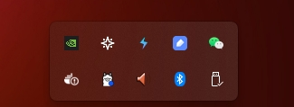

- api服务验证：浏览器端输入```127.0.0.1:11434```，显示```ollama id running```即为正常

  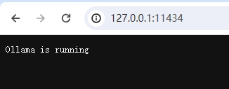


### 1.2、open webui安装

> [Open WebUI](https://github.com/open-webui/open-webui)是一个可扩展、功能强大且用户友好的自主WebUI，旨在完全离线操作。它支持多种LLM运行器，包括Ollama和OpenAI，兼容API。

- 基于docker安装open webui

```
docker run -d -p 3000:8080 --add-host=host.docker.internal:host-gateway -v open-webui:/app/backend/data --name open-webui --restart always ghcr.io/open-webui/open-webui:main
```

- 本地打开：```localhost:3000```

首次打开需要注册，第一位注册的用户默认为管理员（注册的信息随便填写，只要邮箱符合@规则即可）

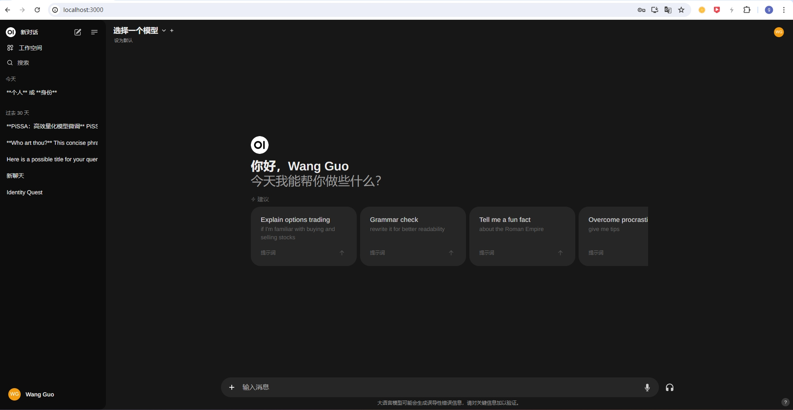

此时我们点击“选择一个模型”的时候是没有模型列表的，这个时候就需要配置ollama了

### 1.3、open webui引入ollama

- 首先，我们需要让ollama可以通过本地ip访问，windows下需要新建```环境变量```。

> 步骤：windows下直接搜索**编辑系统环境变量**-**环境变量**-在系统变量中**新建**-**变量名：OLLAMA_HOST；变量值：0.0.0.0**
>
> 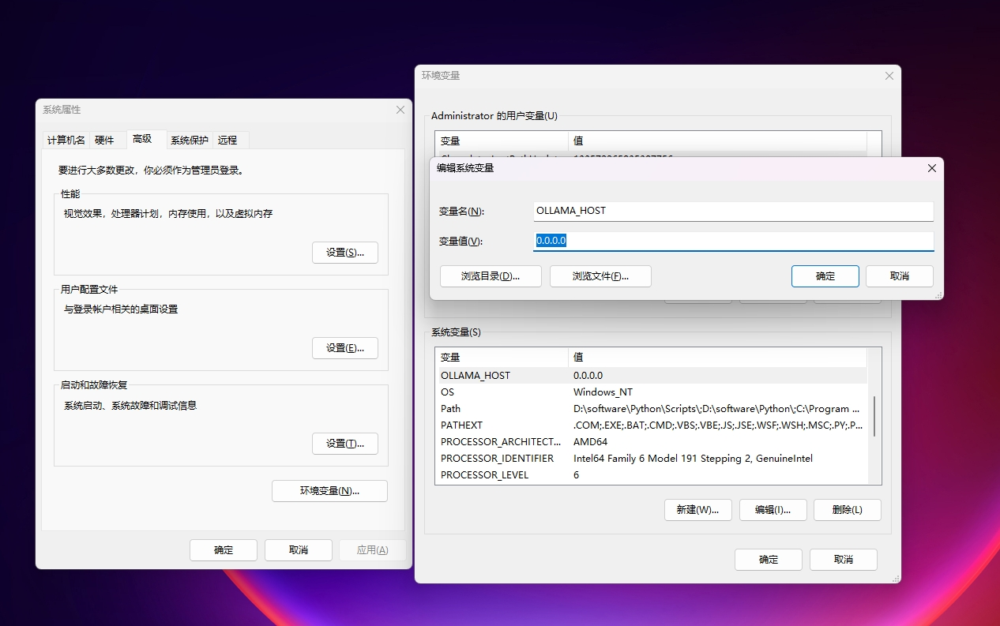

- 验证ollama：此时在浏览器输入本地ip+端口号就显示可以正常使用了。比如我的地址为：```192.168.1.9:11434```

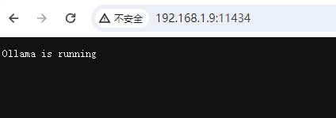

- 在open webui中配置ollama服务，并进行验证

> 步骤：点击右上角的图标-**设置**-**管理员设置**-**外部连接**-在ollama api中填写**本地ip+端口号**，如```192.168.1.9:11434```
>
> 验证：点击后面的刷新按钮，弹出**已验证服务器连接**

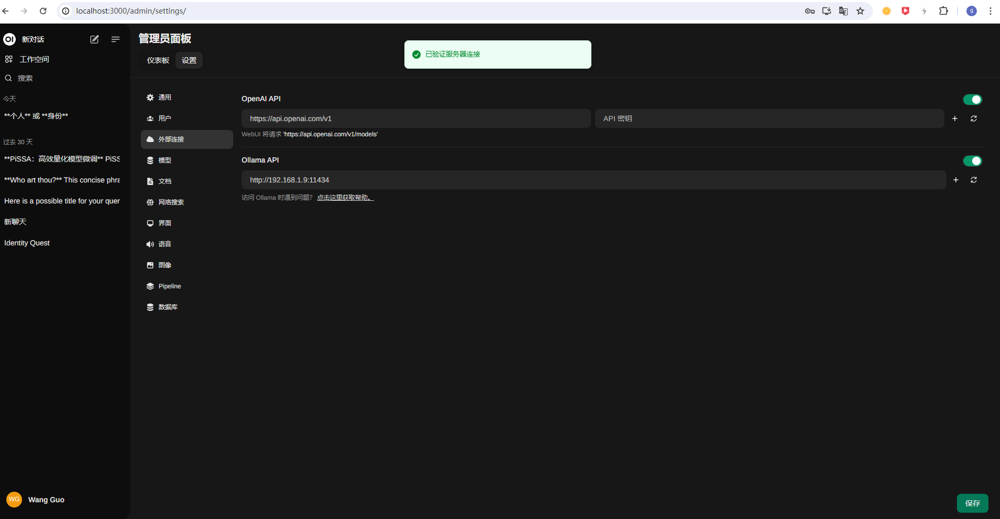

- open webui中使用ol lama服务

此时就可以选择ollama下载的模型进行对话使用了

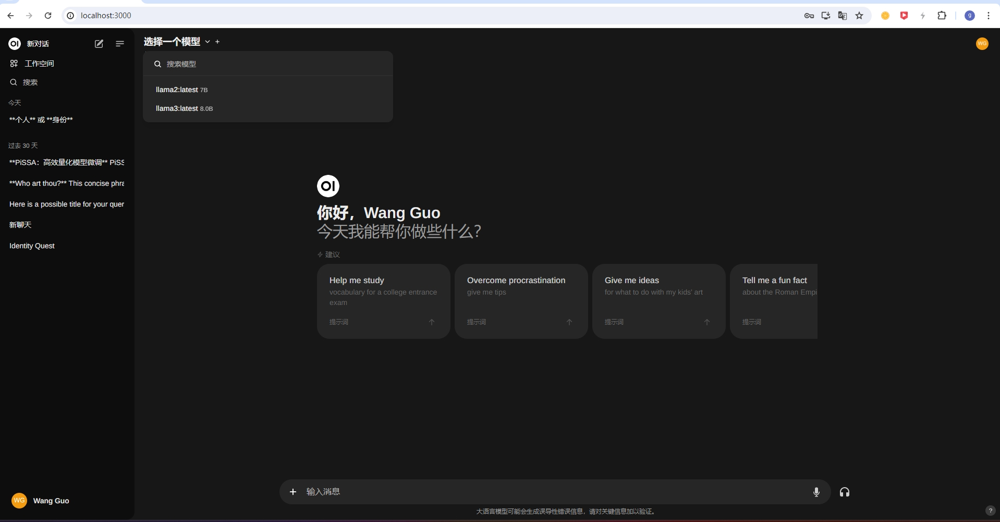

## 2、在open webui中连接sd，引入图像生成的功能

### 2.1、sd webui安装

- 前提：需要安装git/python

```
git clone https://github.com/AUTOMATIC1111/stable-diffusion-webui.git
./webui.bat
```

- 打开```本地IP+端口号7860```

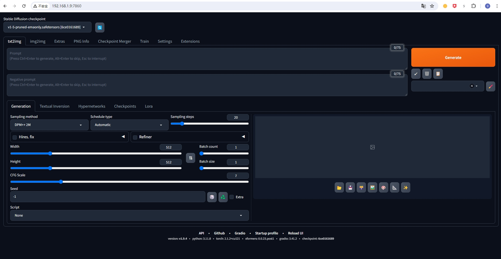

- 在```web.bat```中添加启动参数（13行左右），以便sd提供api服务

```
set COMMANDLINE_ARGS=--xformers --api --listen --share
```

### 2.2、open webui引入sd

在**管理员面板**- **设置**-**图像**里面按照下图进行配置，所有的参数都可以根据自己的进行修改

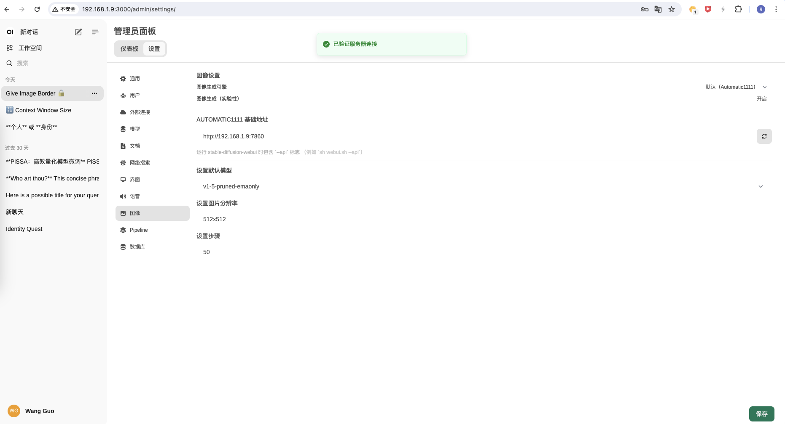

## 3、使用

- 正常对话，进行描述

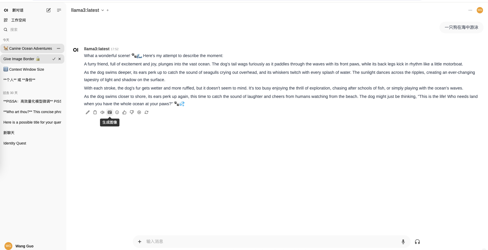

- 点击**图像生成**按钮，便可以生成图像

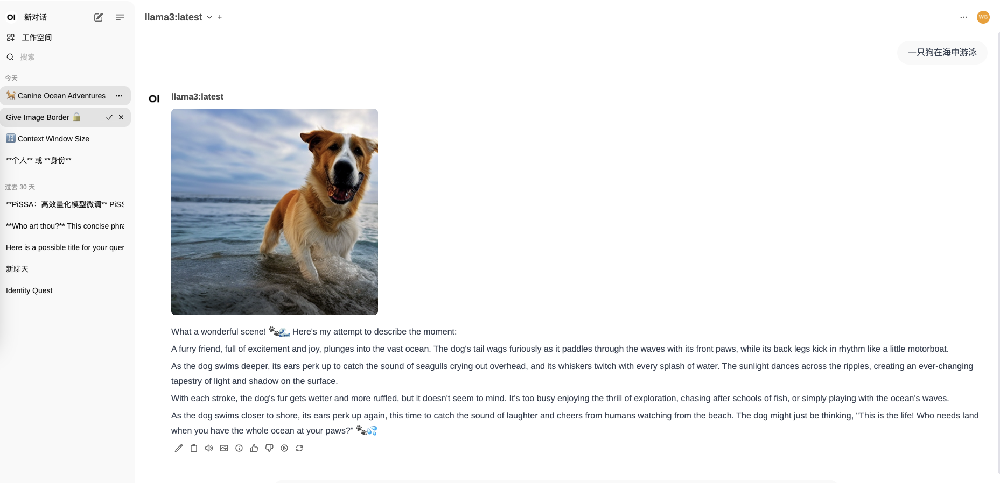
