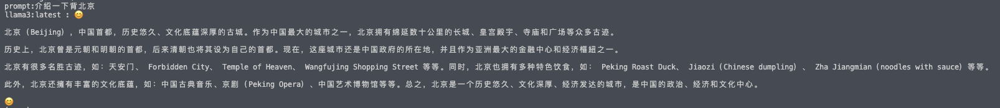

> 用程序调用api搭建自己的ollama

## ollama api

```
/api/tags：罗列本地模型
```

```
/api/show：显示模型信息
```

```
/api/copy
```

```
/api/delete
```

```
/api/pull
```

```
/api/push
```


````
api/generate：生成
````

### 参数

- `model`：（必填）[模型名称](https://github.com/ollama/ollama/blob/main/docs/api.md#model-names)
- `prompt`：生成响应的提示
- `suffix`：模型响应后的文本
- `images`：（可选）base64编码图像列表（用于多模态模型，例如`llava`）

高级参数（可选）：

- `format`：返回响应的格式。目前唯一接受的值是`json`
- `options`[： Modelfile](https://github.com/ollama/ollama/blob/main/docs/modelfile.md#valid-parameters-and-values)文档中列出的其他模型参数，例如`temperature`
- `system`：系统消息（覆盖 中定义的内容`Modelfile`）
- `template`：要使用的提示模板（覆盖 中定义的内容`Modelfile`）
- `context`：从上一次请求返回的上下文参数`/generate`，可用于保存简短的对话记忆
- `stream`：如果`false`响应将作为单个响应对象返回，而不是对象流
- `raw`：如果`true`提示不应用任何格式。`raw`如果您在向 API 发出的请求中指定了完整的模板提示，则可以选择使用该参数
- `keep_alive`：控制模型在请求后保持加载到内存中的时间（默认值`5m`：）


```
/api/chat：聊天
```

### 参数

- `model`：（必填）[模型名称](https://github.com/ollama/ollama/blob/main/docs/api.md#model-names)
- `messages`：聊天消息，可用于保存聊天记忆
- `tools`：模型使用的工具（如果支持）。需要`stream`设置为`false`

该`message`对象具有以下字段：

- `role`：消息的角色，可以是`system`、`user`、`assistant`或`tool`
- `content`：消息内容
- `images`（可选）：要包含在消息中的图像列表（用于多模式模型，例如`llava`）
- `tool_calls`（可选）：模型想要使用的工具列表

高级参数（可选）：

- `format`：返回响应的格式。目前唯一接受的值是`json`
- `options`[： Modelfile](https://github.com/ollama/ollama/blob/main/docs/modelfile.md#valid-parameters-and-values)文档中列出的其他模型参数，例如`temperature`
- `stream`：如果`false`响应将作为单个响应对象返回，而不是对象流
- `keep_alive`：控制模型在请求后保持加载到内存中的时间（默认值`5m`：）


## 简单使用

```
import requests
import json

url_generate = "http://localhost:11434/api/generate"
url_chat = "http://localhost:11434/api/chat"

txt = input("prompt:")

def get_response(url, data):
    response = requests.post(url, json=data)
    response_dict = json.loads(response.text)
    response_content = response_dict["response"]
    return response_content

data = {
    "model": "llama3:latest",
    "prompt": "请用中文回复{}".format(txt),
    "stream": False
}


res = get_response(url_generate,data)

print(data["model"],":",res)
```



## 与LangChain一起使用

> 参考：https://github.com/ollama/ollama/blob/main/docs/tutorials/langchainpy.md
