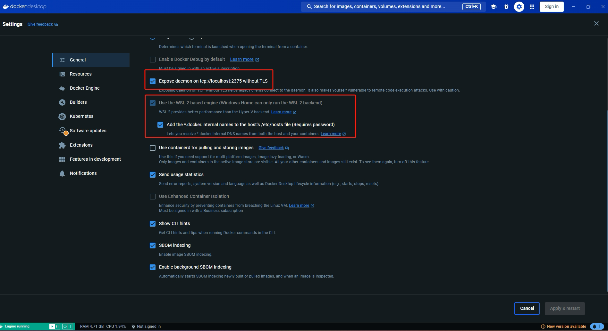
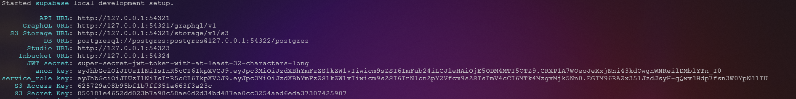
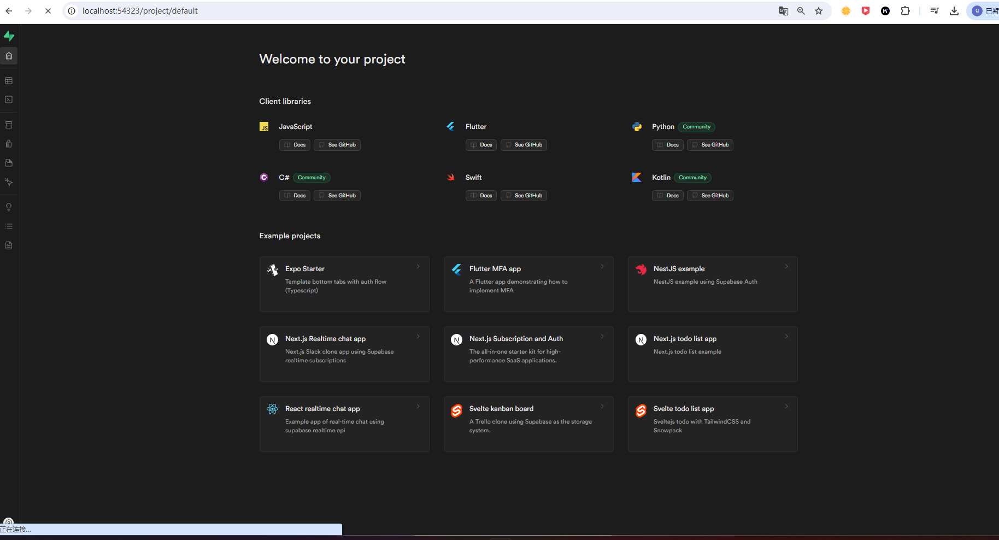
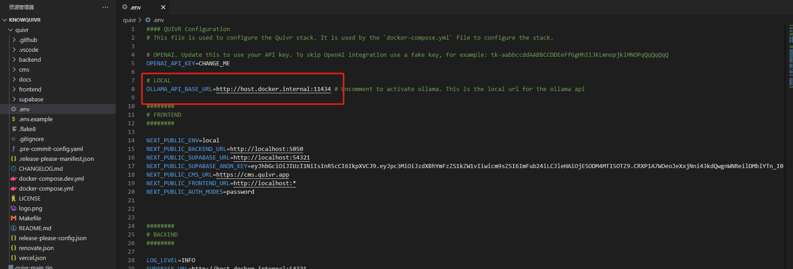

> 部署环境：Windows

## 安装 `supabase`向量数据库

### 安装Windows下的包管理器scoop

```powershell
set-executionpolicy remotesigned -scope currentuse
iex (new-object net.webclient).downloadstring('https://get.scoop.sh')
```

### 使用scoop安装supabase

> 参考：https://supabase.com/docs/guides/cli/getting-started?queryGroups=platform&platform=windows

```powershell
scoop bucket add supabase https://github.com/supabase/scoop-bucket.git
scoop install supabase
```

在运行supabase之前，需要先配置docker desktop



设置好之后开始运行`supabase`

```
supabase start
```



此时浏览器端输入`http://192.168.1.8:54323/`就能看到`supabase`的界面




## 安装`Quivr`

```
git clone https://github.com/quivrhq/quivr.git 
cd quivr
cp .env.example .env
```

修改`.env`的参数，取消注释



```
docker compose up
```

PS：这一步需要的时间是真长啊～

登陆`localhost:3000`,账号邮箱`admin@quivr.app`,密码`admin`


PS：*不弄了～这玩意是真连不上。上一个版本就是，这个版本的Quivr也是，闹心～～～*


