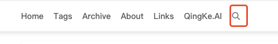
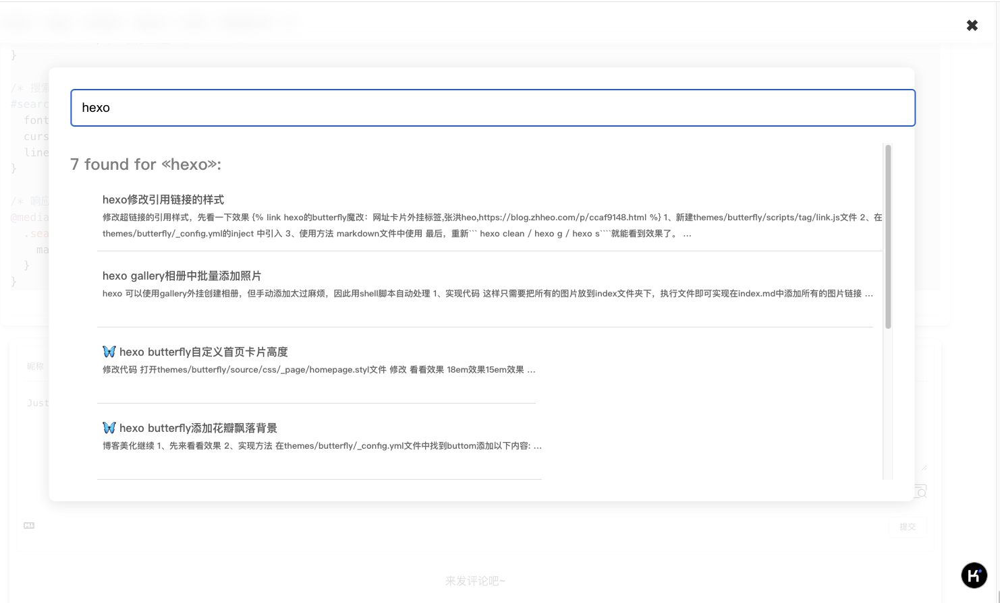

> 在zola主题博客中，引入搜索功能

## html添加搜索按钮，并引入css,js文件

```html

  <li>
    <span id="search-ico" class="ms-Icon--Search">
      <i class="fa-solid fa-magnifying-glass"></i>
    </span>
  </li>

  <div class="search-overlay">
    <button id="close-search" class="close-button">✖</button> <!-- 关闭按钮 -->
    <div class="search-container">
      <input type="text" id="search" placeholder="Search..."/>
      <ul class="search-results">
        <h2 class="search-results__header"></h2>
        <ul class="search-results__items"></ul>
      </ul>
    </div>
  </div>

```

同时需要引入js,css文件

```html
<head>
  
    <script type="text/javascript" src="{{ get_url(path='elasticlunr.min.js') | safe }}" defer></script>
    <script type="text/javascript" src="{{ get_url(path='search_index.en.js') | safe }}" defer></script>
  
    <script type="text/javascript" src="{{ get_url(path='js/search.js') | safe }}" defer></script>
</head>
```

## search.js文件

Search.js会生zola build的时候生成`elasticlunr.min.js`和`search_index.en.js`

```js
// search script, optimized

// 防抖函数：避免频繁触发函数执行，提高性能
function debounce(func, wait) {
  let timeout;
  return function (...args) {
    clearTimeout(timeout);
    timeout = setTimeout(() => func.apply(this, args), wait);
  };
}

// 生成搜索结果摘要，高亮显示搜索词
function makeTeaser(body, terms) {
  const TERM_WEIGHT = 40, NORMAL_WORD_WEIGHT = 2, FIRST_WORD_WEIGHT = 8, TEASER_MAX_WORDS = 30;
  const stemmedTerms = terms.map(w => elasticlunr.stemmer(w.toLowerCase()));
  let termFound = false, index = 0, weighted = [], sentences = body.toLowerCase().split(". ");

  sentences.forEach((sentence, i) => {
    let words = sentence.split(" ");
    let value = FIRST_WORD_WEIGHT;

    words.forEach(word => {
      if (word.length > 0) {
        if (stemmedTerms.some(term => elasticlunr.stemmer(word).startsWith(term))) {
          value = TERM_WEIGHT;
          termFound = true;
        }
        weighted.push([word, value, index]);
        value = NORMAL_WORD_WEIGHT;
      }
      index += word.length + 1; // include space or punctuation
    });
    index += 1; // sentence boundary
  });

  if (!weighted.length) return body;

  // 滑动窗口计算最高权重的片段
  let windowSize = Math.min(weighted.length, TEASER_MAX_WORDS);
  let curSum = weighted.slice(0, windowSize).reduce((sum, [_, weight]) => sum + weight, 0);
  let windowWeights = [curSum];
  for (let i = 0; i < weighted.length - windowSize; i++) {
    curSum = curSum - weighted[i][1] + weighted[i + windowSize][1];
    windowWeights.push(curSum);
  }

  let maxSumIndex = termFound ? windowWeights.lastIndexOf(Math.max(...windowWeights)) : 0;
  let teaser = [], startIndex = weighted[maxSumIndex][2];
  
  for (let i = maxSumIndex; i < maxSumIndex + windowSize; i++) {
    let [word, weight, wordIndex] = weighted[i];
    if (startIndex < wordIndex) teaser.push(body.substring(startIndex, wordIndex));
    teaser.push(weight === TERM_WEIGHT ? `<b>${word}</b>` : word);
    startIndex = wordIndex + word.length;
  }
  
  teaser.push("…");
  return teaser.join("");
}

// 格式化搜索结果
function formatSearchResultItem(item, terms) {
  const li = document.createElement("li");
  li.classList.add("search-results__item");

  const link = document.createElement("a");
  link.href = item.ref;
  link.classList.add("search-results__title"); // 添加类名以便于样式调整
  link.innerText = item.doc.title;

  const teaser = document.createElement("div");
  teaser.classList.add("search-results__teaser");
  teaser.innerHTML = makeTeaser(item.doc.body, terms);

  li.appendChild(link);
  li.appendChild(teaser);
  
  return li;
}

// 切换搜索框和毛玻璃效果
function toggleSearchMode() {
  const searchOverlay = document.querySelector(".search-overlay");
  const searchIcon = document.querySelector("#search-ico");
  const closeSearch = document.querySelector("#close-search");

  // 显示搜索页面
  searchIcon.addEventListener("click", () => {
    searchOverlay.style.display = "flex"; // 显示搜索页面
    document.getElementById("search").focus(); // 让输入框获得焦点
  });

  // 关闭搜索页面
  closeSearch.addEventListener("click", () => {
    searchOverlay.style.display = "none"; // 隐藏搜索页面
    document.getElementById("search").value = ""; // 清空输入框
    document.querySelector(".search-results__items").innerHTML = ""; // 清空搜索结果
  });
}

// 初始化搜索
function initSearch() {
  const searchInput = document.getElementById("search");
  const searchResults = document.querySelector(".search-results");
  const searchResultsItems = document.querySelector(".search-results__items");
  const searchResultsHeader = document.querySelector(".search-results__header");
  const MAX_ITEMS = 100;
  const options = {
    bool: "AND",
    fields: {
      title: {boost: 2},
      body: {boost: 1}
    }
  };
  let currentTerm = "";
  const index = elasticlunr.Index.load(window.searchIndex);

  searchInput.addEventListener("keyup", debounce(() => {
    const term = searchInput.value.trim();
    if (term === currentTerm || !index) {
      return;
    }
    searchResultsItems.innerHTML = "";
    if (term === "") {
      searchResults.style.display = "none";
      return;
    }

    const results = index.search(term, options).filter(r => r.doc.body !== "");
    if (results.length === 0) {
      searchResultsHeader.innerText = `Nothing like «${term}»`;
      return;
    }

    currentTerm = term;
    searchResultsHeader.innerText = `${results.length} found for «${term}»:`;
    results.slice(0, MAX_ITEMS).forEach(result => {
      if (result.doc.body) {
        searchResultsItems.appendChild(formatSearchResultItem(result, term.split(" ")));
      }
    });
  }, 150));
}

// 调用搜索模式切换
toggleSearchMode();
initSearch();

// 初始化搜索功能在页面加载后触发
if (document.readyState === "complete" || (document.readyState !== "loading" && !document.documentElement.doScroll)) {
  initSearch();
} else {
  document.addEventListener("DOMContentLoaded", initSearch);
}

// 移动端导航菜单切换
function burger() {
  const trees = document.querySelector("#trees");
  const mobileIcon = document.querySelector("#mobile");
  const isVisible = trees.style.display === "block";
  trees.style.display = isVisible ? "none" : "block";
  mobileIcon.className = isVisible ? "ms-Icon--GlobalNavButton" : "ms-Icon--ChromeClose";
}

// 代码块复制按钮逻辑
function createCopyButton(highlightDiv) {
  const button = document.createElement("button");
  button.className = "copy-code-button";
  button.type = "button";
  button.innerHTML = "&#xE8C8;";
  button.addEventListener("click", () => copyCodeToClipboard(button, highlightDiv));
  addCopyButtonToDom(button, highlightDiv);
}

async function copyCodeToClipboard(button, highlightDiv) {
  const codeToCopy = highlightDiv.querySelector(":last-child > code").innerText;
  try {
    const result = await navigator.permissions.query({ name: "clipboard-write" });
    if (result.state === "granted" || result.state === "prompt") {
      await navigator.clipboard.writeText(codeToCopy);
    } else {
      fallbackCopyCode(codeToCopy, highlightDiv);
    }
  } catch (_) {
    fallbackCopyCode(codeToCopy, highlightDiv);
  } finally {
    showCopiedFeedback(button);
  }
}

// 回退复制方法
function fallbackCopyCode(codeToCopy, highlightDiv) {
  const textArea = document.createElement("textarea");
  textArea.value = codeToCopy;
  document.body.appendChild(textArea);
  textArea.select();
  document.execCommand("copy");
  document.body.removeChild(textArea);
}

// 显示复制成功反馈
function showCopiedFeedback(button) {
  button.innerHTML = "&#xE74E;";
  setTimeout(() => (button.innerHTML = "&#xE8C8;"), 2000);
}

// 添加复制按钮到 DOM
function addCopyButtonToDom(button, highlightDiv) {
  highlightDiv.insertBefore(button, highlightDiv.firstChild);
}

// 为每个代码块添加复制按钮
document.querySelectorAll("pre").forEach(createCopyButton);
```

## css样式文件（style.css）

```css
/* 搜索页面弹窗 */
.search-overlay {
  position: fixed;
  top: 0;
  left: 0;
  width: 100%;
  height: 100vh;
  display: none; /* 默认隐藏 */
  background-color: rgba(255, 255, 255, 0.8); /* 半透明背景 */
  backdrop-filter: blur(10px); /* 毛玻璃效果 */
  z-index: 1000;
  justify-content: center;
  align-items: flex-start; /* 从顶部对齐 */
}

/* 搜索框容器 */
.search-container {
  background-color: white;
  padding: 2rem;
  border-radius: 10px;
  box-shadow: 0 4px 20px rgba(0, 0, 0, 0.1);
  max-width: 80%; /* 增加最大宽度 */
  width: 100%;
  position: absolute; /* 使用绝对定位 */
  top: 10%; /* 位置 */
  transform: translate(-50%, 0); /* 使容器在水平和垂直上居中 */
  left: 50%; /* 水平居中 */
}

/* 搜索输入框 */
#search {
  width: 100%;
  padding: 1rem;
  font-size: 1.2rem;
  border: 1px solid #ddd;
  border-radius: 5px;
  margin-bottom: 1.5rem;
}

/* 关闭按钮 */
#close-search {
  position: absolute;
  top: 20px;
  right: 20px;
  font-size: 1.5rem;
  cursor: pointer;
  z-index: 1001; /* 确保按钮位于最前 */
  color: #333; /* 关闭按钮颜色 */
}
.close-button {
  position: absolute;
  top: 10px;
  right: 20px;
  background: none;
  border: none;
  font-size: 10px;
  cursor: pointer;
}

/* 搜索结果样式 */
.search-results {
  height: 500px;
  overflow-y: auto; /* 允许上下滚动 */
  list-style-type: none; /* 去掉默认列表样式 */
  padding: 0; /* 去掉内边距 */
  margin: 0; /* 去掉外边距 */
}

/* 搜索结果项 */
.search-results__item {
  height: 80px; /* 固定高度 */
  margin-bottom: 1rem; /* 项目之间的间距 */
  padding: 0.5rem; /* 内边距 */
  border-bottom: 1px solid #ddd; /* 底部边框 */
  transition: background-color 0.3s ease; /* 背景色变化效果 */
  font-size: 0.85rem; /* 缩小字体大小 */
}

/* 悬停效果 */
.search-results__item:hover {
  background-color: #f9f9f9; /* 鼠标悬停时改变背景色 */
}

/* 搜索结果标题 */
.search-results__item a {
  font-size: 1rem; /* 搜索结果标题的字体大小 */
  color: #333; /* 标题颜色 */
  text-decoration: none; /* 去掉下划线 */
}

/* 搜索结果摘要 */
.search-results__teaser {
  font-size: 0.8rem; /* 搜索结果摘要的字体大小 */
  color: #666; /* 摘要颜色 */
}

/* 搜索图标 */
#search-ico {
  font-family: 'FabricMDL2Icons';
  cursor: pointer;
  line-height: 1;
}

/* 响应式布局 */
@media (max-width: 768px) {
  .search-container {
    max-width: 90%; /* 移动端最大宽度调整 */
  }
}
```

## 效果




