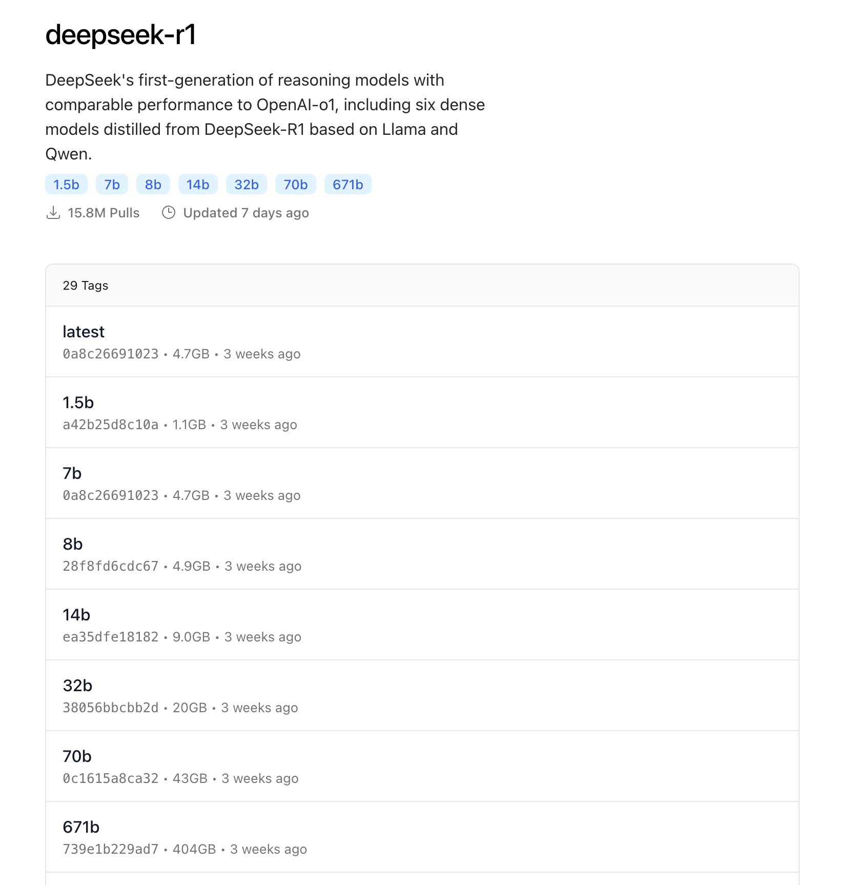
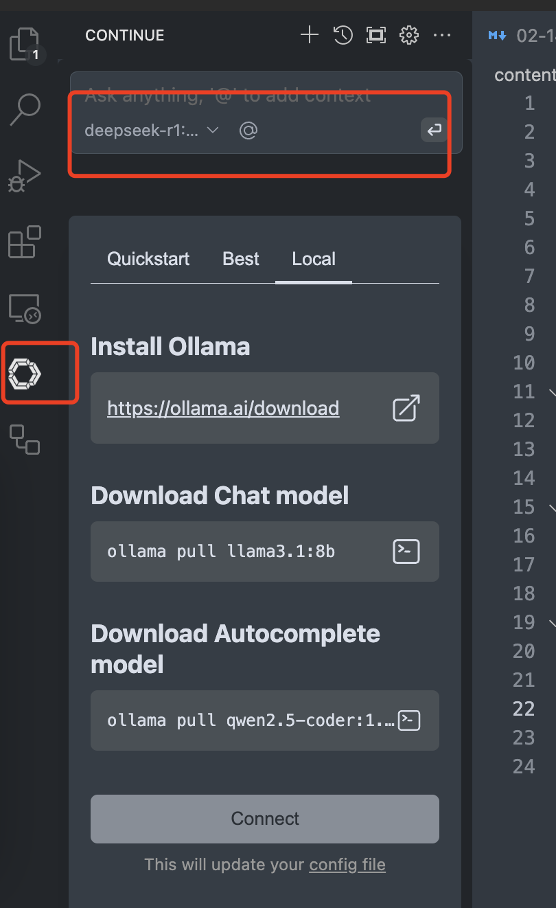
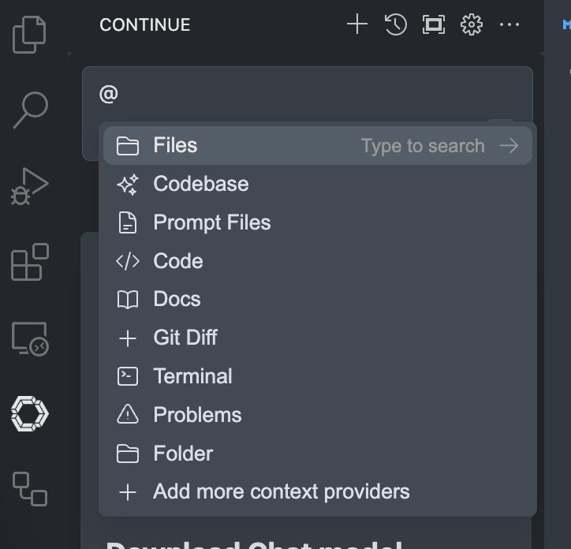

> DeepSeek R1最近很火，可以试试用来编程（前提是有VSCode）

## DeepSeek R1本地部署
可以通过ollama实现（[ollama官网](https://ollama.com/)下载安装即可）

使用终端pull & 运行 r1。官网有不同参数版本的r1模型，量力选择！



```
ollama run deepseek-r1:7b
```

## 在VSCode中使用
vscode插件中，搜索`Continue`插件安装



选择本地的 `ollama` 服务，并选择 `r1` 模型即可



`Continue`可以通过 `@` 实现文档内容交互


