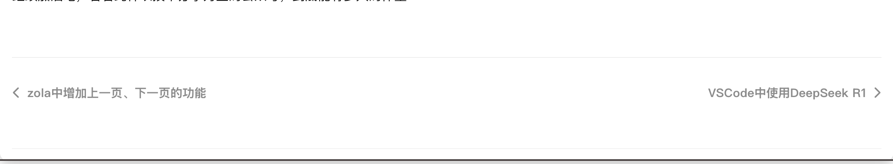

## html模版
```
{# 修改后的导航部分 #}



{# 获取当前页面索引 #}


    
    
    

<div class="post-navigation">
    {# 上一篇 #}
    <div class="nav-item prev">
    
        
        
        <a href="{{ prev_page.permalink }}" class="nav-link">
        <i class="fas fa-chevron-left"></i>
        <span class="nav-title">{{ prev_page.title | truncate(length=50) }}</span>
        </a>
    
        <span class="nav-disabled"></span>
    
    </div>

    {# 下一篇 #}
    <div class="nav-item next">
    
        
        
        <a href="{{ next_page.permalink }}" class="nav-link">
        <span class="nav-title">{{ next_page.title | truncate(length=50) }}</span>
        <i class="fas fa-chevron-right"></i>
        </a>
    
        <span class="nav-disabled"></span>
    
    </div>
</div>

<style>
  .post-navigation {
    margin: 3rem 0;
    display: flex;
    justify-content: space-between;
    border-top: 1px solid #eee;
    padding-top: 2rem;
  }

  .nav-item {
    flex: 1;
    max-width: 45%;
  }

  .nav-item.prev {
    text-align: left;
    padding-right: 1rem;
  }

  .nav-item.next {
    text-align: right;
    padding-left: 1rem;
  }

  .nav-link {
    color: #2c3e50;
    display: inline-flex;
    align-items: center;
    gap: 0.5rem;
    transition: color 0.3s ease;
  }

  .nav-link:hover {
    color: #3498db;
    text-decoration: none;
  }

  .nav-disabled {
    color: #95a5a6;
    font-style: italic;
  }

  .nav-title {
    overflow: hidden;
    text-overflow: ellipsis;
    white-space: nowrap;
  }

  @media (max-width: 768px) {
    .nav-title {
      max-width: 30vw;
    }
  }
</style>
```

## 效果
- 第一篇


- 中间
