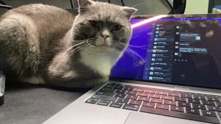

> 

 <!-- 添加 class -->

---
[胡思乱想🤔💡](/about/timeline) ｜ [在线简历📄](jianli/)

## Hi there 👋

🤔 我是Wang Guo(王過，字改之),一个`INTJ`。

## 工作经历
- 2019.07 - 2024.03：🦍[智猩猩/智东西公开课](https://aiorang.com/) 资深课程经理
- 2024.04 - 现在：🔥[青稞社区](https://qingkelab.github.io/talks) 主理人
- 2024.11 - 现在：🐜[蚂蚁技术研究院](https://antresearch.com) 资深技术运营

## 联系方式
📫 Email: [wangguo113@gmail.com](mailto:wangguo113@gmail.com)
 💬 [WeChat](./wechat.jpg): 15633578977

## 我有一只猫🐈
因为是800块钱买的，所以我给它取名：八仔。它是一只折耳猫、英短蓝白，已经陪伴了我四年了！

