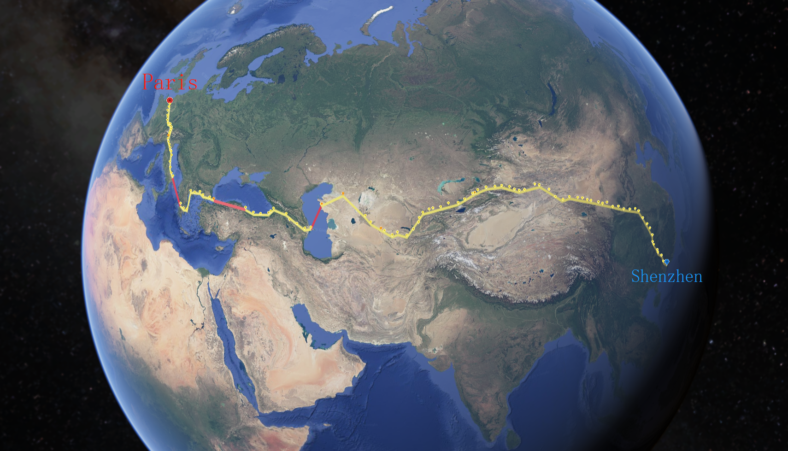

> 

 <!-- 添加 class -->

---
## Hi there 👋

🤔 我是Mingo(周明昭),一个正在沉淀的程序员。

## 教育经历
- 2020.09 - 2023.07：🦍深圳大学   硕士    计算机技术
- 2016.09 - 2020.6：🔥齐鲁工业大学  本科  林产化工

## 学术成果
- [**论文**](https://ieeexplore.ieee.org/abstract/document/9756310)：FAITH: A Fast Blockchain-Assisted Edge Computing Platform for Healthcare Applications
- [**专利**](https://patentimages.storage.googleapis.com/17/5e/af/53d393c5c2c413/CN114864069A.pdf)：用于调度任务的方法及装置 CN114864069A

## 工作经历
- 2013.07 - 2023.12：🚗 BYD  技术项目管理
- 2024.11 - 现在：🔥保密

## 其他经历
- 2024.02 - 2024.8：🚴‍♀️[从深圳骑行去法国巴黎](https://www.bilibili.com/video/BV1dpsjebE2d/?share_source=copy_web&vd_source=543b94802d84e6e76a193e0c7e9a4540)

## 联系方式
📫 Email: minglovecoding@gmail.com  
💬 WeChat: minglovefreedom

