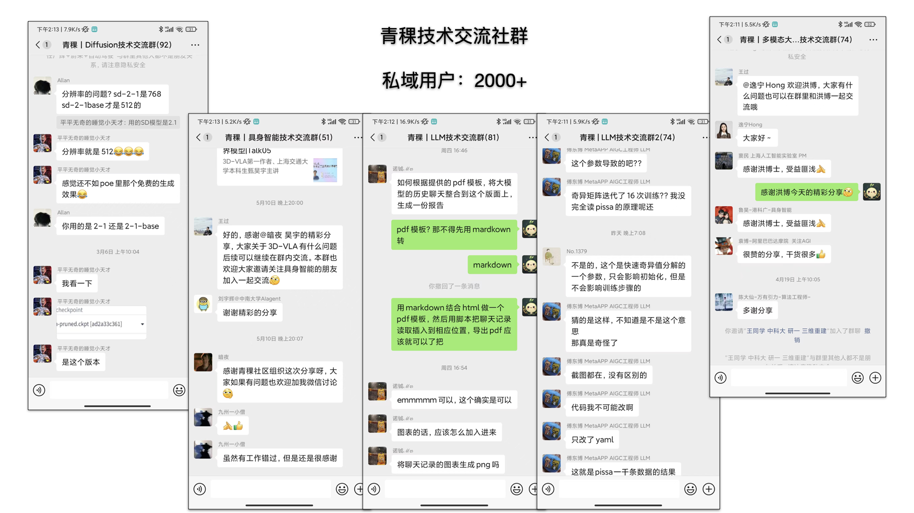
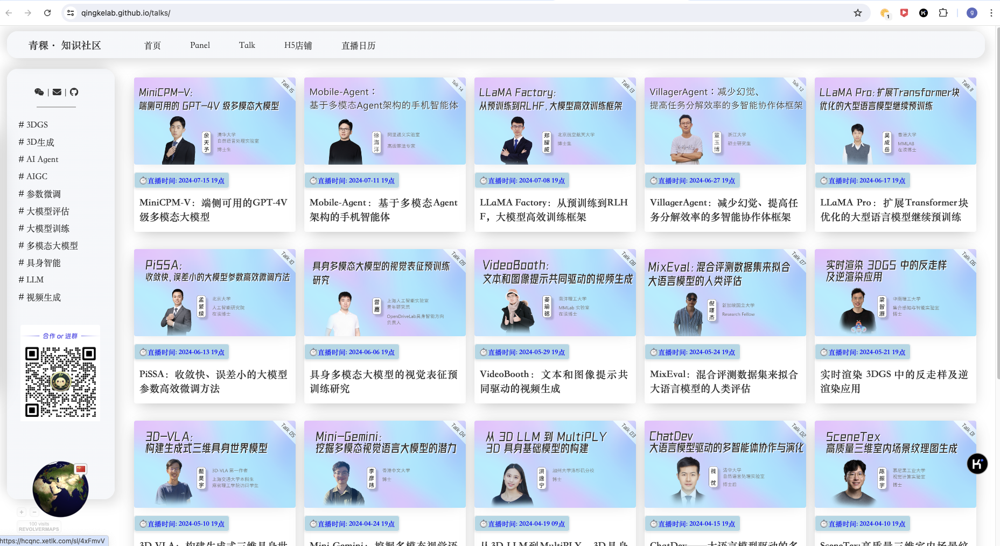
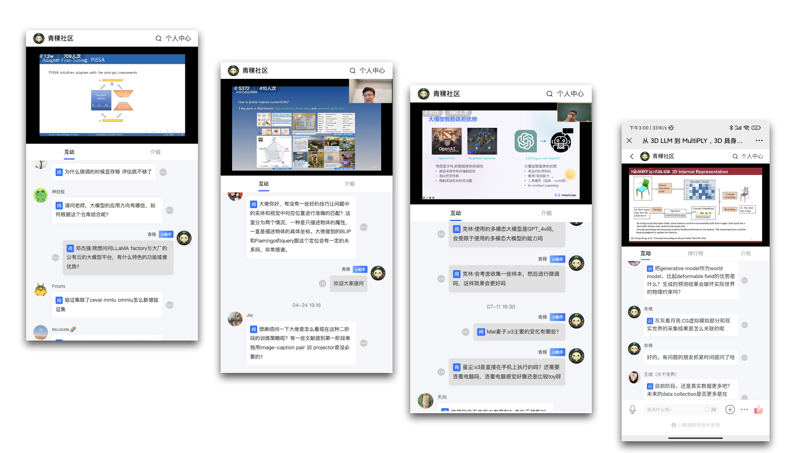

-blue)    

---

## 🙋‍♂️ 个人简介

> 本科计算机科学与技术专业；2019年7月入职北京智一科技，主要负责**AI**领域的课程产品研发，关注LLM&AIGC、计算机视觉、机器人算法、自动驾驶算法等。4年**AI课程产品**的设计、运营经验，具有ToC/B沟通能力。个人喜欢开源技术，有基本的开源算法复现能力，熟悉Linux操作及AI开发工具，喜欢跑AI算法模型（如YOLO、ChatGLM、LLaMa、SD等）。

## 🧱 工作经历
> ### 2024.11 - 现在 [蚂蚁技术研究院](https://antresearch.com) 资深技术运营

- 研究院渠道体系构建及运营、学术成果PR

> ### 2019.07 - 2024.03  [北京智一科技](https://zhidx.com/about) 资深课程经理/[智东西公开课](https://course.zhidx.com/ )教研组Leader

主要负责AI领域课程产品研发
- **追踪**AIGC/大模型/机器人/自动驾驶前沿算法，**带领**2-5人团队，**从0搭建**ToC课程产品：[讲座](https://course.zhidx.com/topic/detail/YmE3M2QxN2I4YmE0M2IwMGQ0MjM=)、设计研发ToB课程产品：[技术公开课](https://course.zhidx.com/topic/detail/NjUyYmQxZjU4N2JmZjliNzZlMjM=)。
- 从 0 - 1 调研、设计、定位、策划课程方案，协调运营和设计同事完成课程上线、推广、直播，累计300+期课程，受众达70+w。
- 筛选、邀请、联系、协调、维护500+位优秀青年学者达成课程直播合作（部分[合作讲者名单](https://wangguo.site/link/)），覆盖国内外100+所高校，以及大模型创新团队潞晨科技、智谱AI、面壁智能、联汇科技、一流科技等。
- **ToB业务支持**：对接百度Apollo、NVIDIA、英特尔等20+家大型公司，跨部门对接运营、销售、商务、设计，提供专业内容设计与输出，保证执行进度与直播效果。

------

## 🔥项目经历

#### 2024.03 - 至今：[青稞社区](qingkelab.github.io)（面向人工智能领域的开源技术交流社区、知识服务社区）

- **社区主理/运营**

	
▶️社区成果案例展示
	
	
	
	
	

#### 2022.01 - 2024.03：ToC产品·新青年讲座 负责人
- **关注**前沿技术发展趋势，**策划**了AI新青年讲座、自动驾驶新青年讲座等12档讲座栏目。
- 其中AI新青年讲座125期，受众15000+、点击量200000+；自动驾驶新青年讲座14期，受众7000+、点击量55000+。
- **连接**博士生/助理教授等青年讲者500+名，覆盖海内外高校如MIT、CMU、TUM、NUS、斯坦福、清华、北大等100+余所。
- **对接**运营，设立目标并协助目标完成。
- 进行用户**需求挖掘**，以及讲者的二次挖掘。
- 持续**迭代**讲座产品的设计、运营、流程等。

#### 2022.11 - 2023.06：大型语言模型[技术公开课](https://course.zhidx.com/topic/detail/NjUyYmQxZjU4N2JmZjliNzZlMjM=) 负责人
- **调研** LLM/VLM/MLLM 产品 ，以及大模型产业和相关技术，制作大模型产业图谱和技术图谱，在ChatGPT爆火前就对其进行**立项**。
- **策划**大型语言模型技术公开课**方案**，联系并沟通邀请企业大模型负责人。
- **设计**课程主题提纲。**跨部门沟通**制作推广素材，确认**推广运营方案**。
- **保证**直播进行，对主讲人进行直播培训，并进行直播组织。
- 本课程共策划8期内容，受众1700+，点击量15000+。

#### 2023.02 - 2023.03：[GTIC 2023中国AIGC创新峰会](https://gtic.zhidx.com/2023/aigc/) 委员会成员
- 参与议程与议题设计。
- 寻找并沟通联系大模型/AIGC领域创新企业，邀请参与峰会主题分享。包括北京智谱华章科技、潞晨科技、aiXcoder、计算美学（Nolibox）等。
- 嘉宾对接，设计分享主题，并把关嘉宾PPT。
- 现场活动演讲彩排和部分嘉宾接待。

------

## 🛠 教育背景
> **2015.09-2019.07：石家庄铁道大学 计算机科学与技术专业** **本科**

------

## 🤺 个人技能
- 了解AI、大模型、机器人等前沿算法和技术应用。
- 熟悉开源社区，熟悉**Linux**系统的操作使用，可以跑AI模型。
- 优秀的团队管理、跨部门沟通及协同能力。
- 结果导向，强执行力和自我驱动能力、理解能力和学习能力。
- XMind、PPT、Keynote等。

$ _{update:2024.06} $

